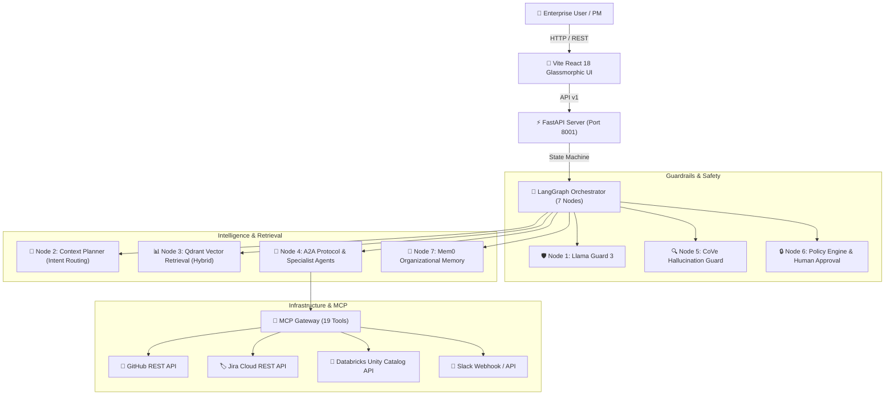

# 🏛️ Enterprise Context Brain (ECB v2.2) — System Architecture Document

> **Repository**: [`Rakesh-infosrc/Enterprise_Context_Brain-ECB-`](https://github.com/Rakesh-infosrc/Enterprise_Context_Brain-ECB-)  
> **Status**: Production Ready | **Version**: v2.2.0 | **Author**: Enterprise Architecture Team  

---

## 1. Executive Summary

**Enterprise Context Brain (ECB v2.2)** is a state-of-the-art GenAI Decision Intelligence & Governed Organizational Memory Operating Console. It bridges real-time enterprise telemetry (Git commits, Jira tickets, Databricks catalogs, Slack communications) with autonomous multi-agent reasoning, strict safety guardrails (Llama Guard 3 & CoVe Hallucination Guard), and enterprise policy enforcement.



---

## 2. 7-Node Stateful Machine Architecture

ECB executes user queries through a deterministic, stateful 7-node LangGraph workflow:

| Node | Name | Module Path | Purpose & Function |
|------|------|-------------|-------------------|
| **Node 1** | **Llama Guard 3** | `llm/llama_guard.py` | PII inspection, prompt injection defense, and input safety gating. |
| **Node 2** | **Context Planner** | `intelligence/context_planner.py` | Intent classification & dynamic routing (Manager, Project, Risk, Decision specialists). |
| **Node 3** | **Qdrant Retrieval** | `vector/qdrant_service.py` | Hybrid dense + sparse vector search across enterprise evidence items. |
| **Node 4** | **A2A Delegation** | `orchestration/a2a_protocol.py` | Agent-to-Agent communication, specialist context synthesis, and LLM answer generation. |
| **Node 5** | **CoVe Guard** | `safety/hallucination_guard.py` | Chain-of-Verification claim extraction and grounding against source evidence. |
| **Node 6** | **Policy Engine** | `safety/policy_engine.py` | Risk-class gating (Low, High, Prohibited) and two-person human approval routing. |
| **Node 7** | **Mem0 Memory** | `memory/mem0_memory.py` | Long-term interaction persistence across 5 organizational memory types. |

---

## 3. Component Interaction & Data Flow

```
[Query Request] 
       │
       ▼
┌─────────────────────────┐
│ 1. Safety Inspection    │ ── (Unsafe) ──▶ [HTTP 400 Blocked]
│ Llama Guard 3           │
└──────────┬──────────────┘
           │ (Safe)
           ▼
┌─────────────────────────┐
│ 2. Intent Classification│ ── Routing ──▶ [Manager / Project / Risk / Decision Agent]
│ Context Planner         │
└──────────┬──────────────┘
           │
           ▼
┌─────────────────────────┐
│ 3. Hybrid RAG Search    │ ── Hybrid Query ──▶ [Qdrant Vector DB]
│ Qdrant Service          │
└──────────┬──────────────┘
           │
           ▼
┌─────────────────────────┐
│ 4. Specialist Synthesis │ ── MCP Tools ──▶ [GitHub / Jira / Databricks / Slack APIs]
│ Agent Orchestrator      │
└──────────┬──────────────┘
           │
           ▼
┌─────────────────────────┐
│ 5. Verification Gate    │ ── Grounding Score < 0.7 ──▶ [Warning Flag Added]
│ Hallucination Guard     │
└──────────┬──────────────┘
           │
           ▼
┌─────────────────────────┐
│ 6. Policy Gating        │ ── High Risk ──▶ [Pending Approval Center]
│ Policy Engine           │
└──────────┬──────────────┘
           │ (Low Risk / Approved)
           ▼
┌─────────────────────────┐
│ 7. Memory Persistence   │ ── Save Context ──▶ [Mem0 Memory DB]
│ Mem0 Service            │
└─────────────────────────┘
```

---

## 4. MCP Tool Catalog (19 Integrations)

ECB embeds an Model Context Protocol (MCP) Gateway exposing 19 governed tools:

```
┌─────────────────────────────────────────────────────────────────┐
│                    ECB MCP Gateway Tool Catalog                 │
├───────────────────────────────┬─────────────────────────────────┤
│ GitHub Tools (2)              │ Jira Tools (2)                  │
│ • github_create_pull_request  │ • jira_create_issue             │
│ • git_tag_release             │ • jira_update_issue             │
├───────────────────────────────┼─────────────────────────────────┤
│ Slack Tools (1)               │ Databricks Tools (11)           │
│ • slack_send_briefing         │ • databricks_list_catalogs      │
│                               │ • databricks_list_schemas       │
│ Data Collection (3)           │ • databricks_list_tables        │
│ • mcp_export_git_training_set │ • databricks_execute_sql        │
│ • mcp_export_jira_training_set│ • databricks_run_job            │
│ • mcp_get_data_collection_report • databricks_list_clusters    │
└───────────────────────────────┴─────────────────────────────────┘
```

---

## 5. Deployment & Infrastructure

- **Backend**: FastAPI running on Python 3.12 (Port 8001), Uvicorn server, SQLAlchemy SQLite relational store.
- **Frontend**: Vite + React 18 + TypeScript + TailwindCSS / Glassmorphism UI (Port 3000).
- **Vector DB**: Qdrant Vector Store (Hybrid dense/sparse embeddings).
- **LLM Integrations**: Groq (`qwen/qwen3.8-27b`) & Google Gemini (`gemini-1.5-flash`).
