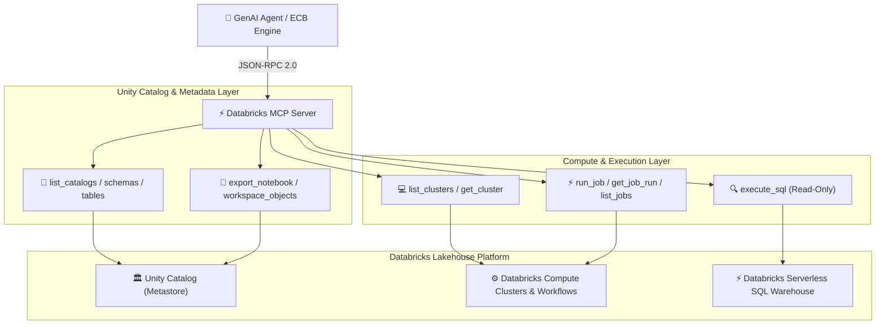

# 🧱 Databricks Agent & Unity Catalog MCP Server — System Architecture Document

> **Repositories**:  
> • [`Rakesh-infosrc/Databricks-Agent-Mcp-Server`](https://github.com/Rakesh-infosrc/Databricks-Agent-Mcp-Server)  
> • [`Rakesh-infosrc/Databricks_study_Plan`](https://github.com/Rakesh-infosrc/Databricks_study_Plan)  
> • [`Rakesh-infosrc/Databricks_Preparation`](https://github.com/Rakesh-infosrc/Databricks_Preparation)  
> **Status**: Active Deployment | **Version**: v2.1 | **Author**: Data Platform & AI Architecture Team  

---

## 1. Executive Summary

The **Databricks Agent & MCP Server Platform** provides enterprise data governance, Unity Catalog metadata extraction, cluster lifecycle management, workflow job execution, and governed SQL query execution. Built on the Model Context Protocol (MCP) spec, it empowers GenAI agents to inspect data lineage, run ETL pipelines, and query Lakehouse tables securely.



---

## 2. Medallion Lakehouse Data Architecture

The platform follows the standard Databricks Medallion Architecture for enterprise data pipelines:

```
┌─────────────────┐       ┌─────────────────┐       ┌─────────────────┐
│  BRONZE LAYER   │ ────▶ │  SILVER LAYER   │ ────▶ │   GOLD LAYER    │
│ Raw Ingestion   │       │ Cleansed/Enriched│      │ Aggregated KPIs │
└─────────────────┘       └─────────────────┘       └─────────────────┘
 • Streaming Ingestion     • Schema Enforcement      • Executive Dashboards
 • JSON / Parquet / Delta  • Deduplication & Audit   • Business Analytics
 • Autoloader CDC          • Data Quality Checks     • Feature Store Models
```

---

## 3. MCP Tool Function Catalog (11 Tools)

| Tool Name | Operation Category | Description | Access Control |
|-----------|-------------------|-------------|----------------|
| `databricks_list_catalogs` | Metadata Inspection | Lists all accessible catalogs in Unity Catalog. | Read-Only |
| `databricks_list_schemas` | Metadata Inspection | Lists schemas within a specified catalog. | Read-Only |
| `databricks_list_tables` | Metadata Inspection | Lists tables, views, and schemas within Unity Catalog. | Read-Only |
| `databricks_list_workspace_objects` | Workspace | Browses notebook and file directory paths. | Read-Only |
| `databricks_export_notebook` | Workspace | Exports notebook content for agent analysis. | Read-Only |
| `databricks_list_clusters` | Compute Management | Enumerates active and terminated clusters. | Read-Only |
| `databricks_get_cluster` | Compute Management | Retrieves cluster runtime metrics & configuration. | Read-Only |
| `databricks_list_jobs` | Workflows & Jobs | Enumerates Databricks Workflows jobs. | Read-Only |
| `databricks_run_job` | Workflows & Jobs | Triggers workflow execution runs via API. | Governed / Action |
| `databricks_get_job_run` | Workflows & Jobs | Polls job run execution state and task logs. | Read-Only |
| `databricks_execute_sql` | Data Querying | Executes read-only SQL statements on SQL Warehouse. | Restricted SQL |

---

## 4. Security & Authentication Architecture

- **Auth Token**: Bearer Personal Access Token (PAT) authentication against `DATABRICKS_HOST`.
- **Unity Catalog RBAC**: Enforces catalog/schema/table level privileges configured in Databricks Account Console.
- **Query Guardrails**: `databricks_execute_sql` restricts `DDL` (`DROP`, `ALTER`, `TRUNCATE`) and limits query execution timeouts.
