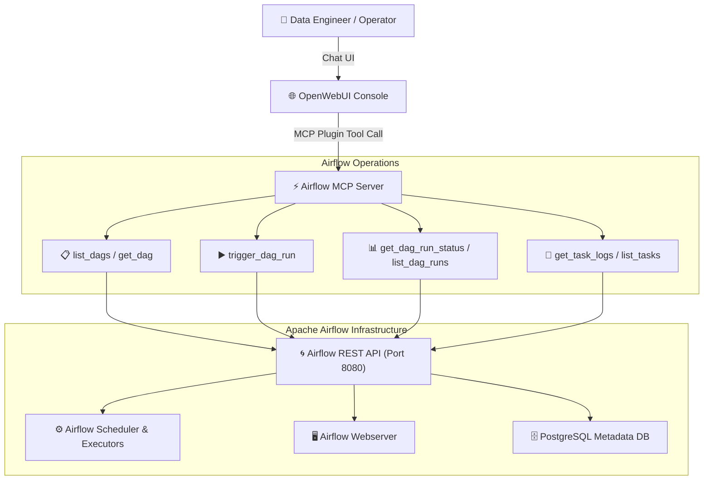

# 🌀 Airflow MCP Server & OpenWebUI Integration — System Architecture Document

> **Repositories**:  
> • [`Rakesh-infosrc/mcp-server-airflow`](https://github.com/Rakesh-infosrc/mcp-server-airflow)  
> • [`Rakesh-infosrc/mcp-airflow-openwebui`](https://github.com/Rakesh-infosrc/mcp-airflow-openwebui)  
> **Status**: Active Deployment | **Version**: v1.2 | **Author**: Workflow & Automation Engineering  

---

## 1. Executive Summary

The **Airflow MCP Server & OpenWebUI Platform** enables conversational workflow management, DAG trigger execution, task failure triage, and Airflow monitoring directly through OpenWebUI and AI agents. It bridges Apache Airflow REST APIs with Model Context Protocol (MCP) tool endpoints.

---

## 2. Airflow MCP Capabilities & Tools

| Tool Name | Airflow Endpoint | Description |
|-----------|------------------|-------------|
| `airflow_list_dags` | `GET /api/v1/dags` | Lists active and paused DAGs across the cluster. |
| `airflow_trigger_dag` | `POST /api/v1/dags/{dag_id}/dagRuns` | Triggers a new DAG execution run with conf payload. |
| `airflow_get_dag_status` | `GET /api/v1/dags/{dag_id}/dagRuns/{run_id}` | Polls DAG run execution status (success, failed, running). |
| `airflow_get_task_logs` | `GET /api/v1/dags/{dag_id}/dagRuns/{run_id}/taskInstances/{task_id}/logs` | Retrieves task execution logs for failure debugging. |
| `airflow_unpause_dag` | `PATCH /api/v1/dags/{dag_id}` | Toggles DAG pause/unpause state. |

---

## 3. Integration Architecture

1. **OpenWebUI Pipeline**: Integrates as an external Function/Tool within OpenWebUI, allowing users to type natural language queries such as *"Trigger the daily settlement DAG and report status"*.
2. **REST Bridge**: Translates MCP JSON-RPC 2.0 tool requests into authenticated Airflow Basic Auth / Bearer REST API calls.
3. **Log & Diagnostic Extractor**: Automatically parses task failure tracebacks to summarize root causes for operators.
