# 🤖 Virtual Receptionist, Clara Bot & QA Automation — System Architecture Document

> **Repositories**:  
> • [`Rakesh-infosrc/virtual-receptionist-ui`](https://github.com/Rakesh-infosrc/virtual-receptionist-ui) & [`virtual-receptionist`](https://github.com/Rakesh-infosrc/virtual-receptionist)  
> • [`Rakesh-infosrc/Clara-deployed-version`](https://github.com/Rakesh-infosrc/Clara-deployed-version) & [`IT_support_bot`](https://github.com/Rakesh-infosrc/IT_support_bot)  
> • [`Rakesh-infosrc/-Mobile-MCP-Test-Automation-Workspace`](https://github.com/Rakesh-infosrc/-Mobile-MCP-Test-Automation-Workspace)  
> **Status**: Active Deployment | **Version**: v1.5 | **Author**: Front-Office & Automation Engineering  

---

## 1. Executive Summary

This architecture domain encompasses front-office conversational AI, automated IT incident escalation, and mobile test automation:

1. **Virtual Receptionist Platform**: Real-time voice and chat receptionist UI/backend with streaming audio dispatch, call routing, and visitor check-in management.
2. **Clara AI & IT Support Bot**: Enterprise incident escalation bot integrated with Jira Service Management and Slack for automated L1/L2 IT support ticket resolution.
3. **Mobile MCP Test Automation Workspace**: MCP-driven mobile test runner automating iOS and Android UI regression suites via Appium and Selenium.

```mermaid
graph TD
    subgraph Virtual Receptionist Front-Office
        Visitor["👤 Office Visitor / Caller"] -->|Voice / Touchscreen UI| VR_UI["🎨 Virtual Receptionist React UI"]
        VR_UI -->|WebSocket / Audio Stream| VR_Backend["⚡ Virtual Receptionist Node/Python Backend"]
        VR_Backend --> STT["🎙️ Speech-to-Text / TTS Engine"]
    end

    subgraph Clara IT Support Bot
        Employee["👤 Internal Employee"] -->|Slack / Web Chat| Clara["🤖 Clara Support Bot"]
        Clara --> JiraSM["🏷️ Jira Service Desk / Incident Triage"]
        Clara --> KB["📚 IT Knowledge Base Vector Search"]
    end

    subgraph Mobile MCP QA Automation
        QAEngineer["👤 QA Engineer"] -->|MCP Trigger| MobileMCP["📱 Mobile MCP Automation Server"]
        MobileMCP --> Appium["📱 Appium / Selenium Mobile Grid"]
        Appium --> Devices["🤖 Android Emulator / iOS Simulator"]
    end
```

---

## 2. Technical Component Matrix

| Module | Stack / Technology | Key Features | Deployment |
|--------|-------------------|--------------|------------|
| **Virtual Receptionist UI** | React 18, Web Audio API, TailwindCSS | Glassmorphic kiosk interface, live audio visualizer, visitor badge printing | Client Kiosk |
| **Virtual Receptionist Backend**| FastHTML / FastAPI, WebSockets, OpenAI Whisper | Streaming speech recognition, live call forwarding, SMS alert notifications | Cloud Container |
| **Clara IT Support Bot** | Python, LangChain, Jira API, Slack SDK | Automated ticket triage, password reset workflow, incident severity routing | Cloud Service |
| **Mobile MCP QA Workspace** | Python, Appium 2.0, Selenium, MCP SDK | AI-driven test script generation, visual regression, automated test reports | CI/CD Runner |
