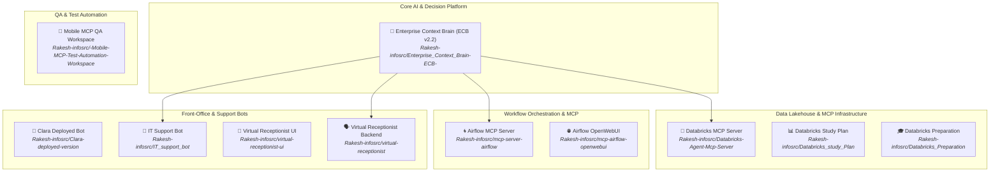

# 🌐 GitHub POC Portfolio — Master Architecture Document

> **Organization**: Acme Global Financial Technologies & InfoServices  
> **Repository Owner**: [`Rakesh-infosrc`](https://github.com/Rakesh-infosrc)  
> **Total POC Projects**: 11 Repositories | **Generated**: August 2026  

---

## 1. Portfolio Overview

This document provides a comprehensive architecture index for all Proof-of-Concept (POC) and production repositories under the `Rakesh-infosrc` GitHub account.

---

## 2. GitHub Repository Sitemap & Architecture Directory

| # | Repository Name | Primary Category | Architecture Specs Document | Key Stack |
|---|-----------------|------------------|-----------------------------|-----------|
| 1 | **`Enterprise_Context_Brain-ECB-`** | Multi-Agent Decision Intelligence | [`01_ENTERPRISE_CONTEXT_BRAIN_ARCHITECTURE.md`](file:///d:/InfoServices/ECB/Architecture%20Docs/01_ENTERPRISE_CONTEXT_BRAIN_ARCHITECTURE.md) | LangGraph, FastAPI, Qdrant, Mem0, React |
| 2 | **`Databricks-Agent-Mcp-Server`** | Data Engineering & Unity Catalog MCP | [`02_DATABRICKS_MCP_AGENT_ARCHITECTURE.md`](file:///d:/InfoServices/ECB/Architecture%20Docs/02_DATABRICKS_MCP_AGENT_ARCHITECTURE.md) | Python, Databricks REST API, PySpark |
| 3 | **`Databricks_study_Plan`** | Lakehouse Medallion Pipeline | [`02_DATABRICKS_MCP_AGENT_ARCHITECTURE.md`](file:///d:/InfoServices/ECB/Architecture%20Docs/02_DATABRICKS_MCP_AGENT_ARCHITECTURE.md) | Delta Lake, PySpark, Unity Catalog |
| 4 | **`Databricks_Preparation`** | Data Certification & Workflows | [`02_DATABRICKS_MCP_AGENT_ARCHITECTURE.md`](file:///d:/InfoServices/ECB/Architecture%20Docs/02_DATABRICKS_MCP_AGENT_ARCHITECTURE.md) | PySpark, SQL Warehouse, ETL |
| 5 | **`mcp-server-airflow`** | Airflow MCP Server | [`03_AIRFLOW_MCP_OPENWEBUI_ARCHITECTURE.md`](file:///d:/InfoServices/ECB/Architecture%20Docs/03_AIRFLOW_MCP_OPENWEBUI_ARCHITECTURE.md) | Python, Airflow REST API, MCP SDK |
| 6 | **`mcp-airflow-openwebui`** | OpenWebUI Chat Plugin | [`03_AIRFLOW_MCP_OPENWEBUI_ARCHITECTURE.md`](file:///d:/InfoServices/ECB/Architecture%20Docs/03_AIRFLOW_MCP_OPENWEBUI_ARCHITECTURE.md) | TypeScript, OpenWebUI, WebSockets |
| 7 | **`Clara-deployed-version`** | Enterprise Support Assistant | [`04_VIRTUAL_RECEPTIONIST_CLARA_BOT_ARCHITECTURE.md`](file:///d:/InfoServices/ECB/Architecture%20Docs/04_VIRTUAL_RECEPTIONIST_CLARA_BOT_ARCHITECTURE.md) | Python, LangChain, Jira API, Slack SDK |
| 8 | **`IT_support_bot`** | IT Incident Escalation | [`04_VIRTUAL_RECEPTIONIST_CLARA_BOT_ARCHITECTURE.md`](file:///d:/InfoServices/ECB/Architecture%20Docs/04_VIRTUAL_RECEPTIONIST_CLARA_BOT_ARCHITECTURE.md) | Python, Jira Service Desk, Slack API |
| 9 | **`virtual-receptionist-ui`** | Front-Office Receptionist Kiosk | [`04_VIRTUAL_RECEPTIONIST_CLARA_BOT_ARCHITECTURE.md`](file:///d:/InfoServices/ECB/Architecture%20Docs/04_VIRTUAL_RECEPTIONIST_CLARA_BOT_ARCHITECTURE.md) | React 18, Web Audio API, TailwindCSS |
| 10 | **`virtual-receptionist`** | Voice & Call Backend | [`04_VIRTUAL_RECEPTIONIST_CLARA_BOT_ARCHITECTURE.md`](file:///d:/InfoServices/ECB/Architecture%20Docs/04_VIRTUAL_RECEPTIONIST_CLARA_BOT_ARCHITECTURE.md) | FastAPI, OpenAI Whisper, WebSockets |
| 11 | **`-Mobile-MCP-Test-Automation-Workspace`** | QA Mobile Test Runner | [`04_VIRTUAL_RECEPTIONIST_CLARA_BOT_ARCHITECTURE.md`](file:///d:/InfoServices/ECB/Architecture%20Docs/04_VIRTUAL_RECEPTIONIST_CLARA_BOT_ARCHITECTURE.md) | Python, Appium 2.0, Selenium |

---

## 3. Unified Enterprise Integration Standard

All 11 POC repositories adhere to standard enterprise communication protocols:
- **Model Context Protocol (MCP)**: Standardized tool schemas for agentic tool invocation across Databricks, Airflow, GitHub, and Jira.
- **REST & OpenAPI v3**: Structured endpoints with JWT bearer authentication.
- **Stateful Agent Workflows**: LangGraph multi-node state machine orchestration with Policy Engine human approvals.
