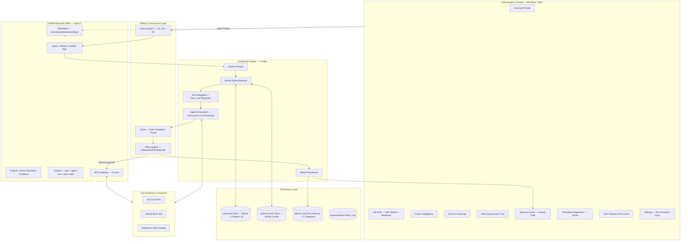
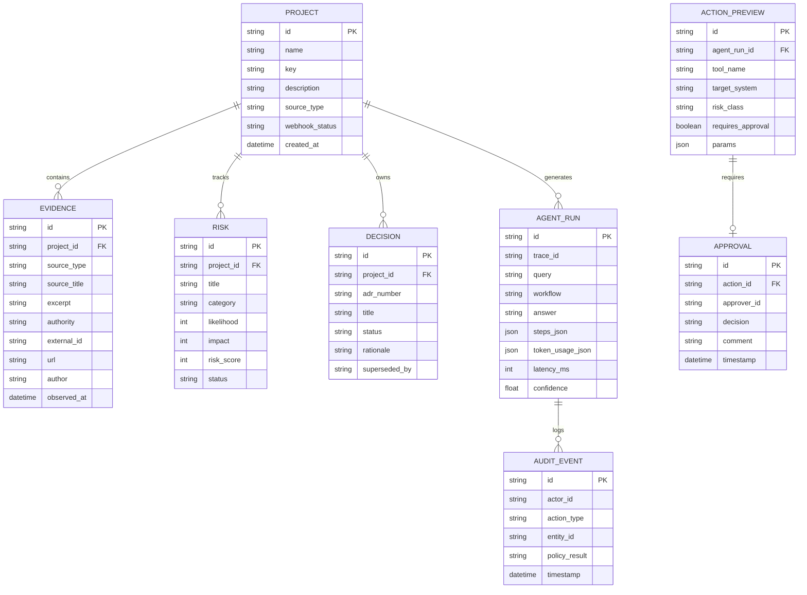
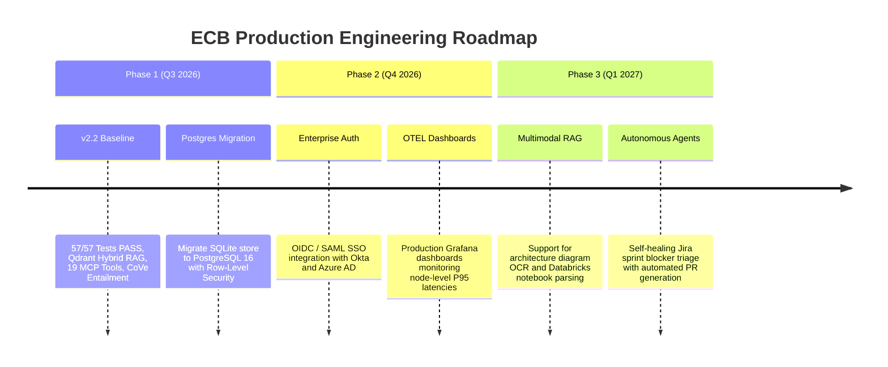

# Enterprise Context Brain (ECB) v2.2
## Product Requirements Document — Governed GenAI Decision Intelligence & Organizational Memory Platform

> **Version**: v2.2 | **Date**: August 2026 | **Author**: ECB Engineering & Architecture Team  
> **Status**: POC Validated & Baseline Established (`bugFix` branch · 57/57 Tests PASS)  

---

## 📋 Table of Contents

1. [Executive Summary](#1-executive-summary)
2. [Problem Statement & Objectives](#2-problem-statement--objectives)
3. [Technical Architecture](#3-technical-architecture)
4. [Functional Requirements](#4-functional-requirements)
5. [Non-Functional Requirements](#5-non-functional-requirements)
6. [Data Model & System Data Flows](#6-data-model--system-data-flows)
7. [Security & Compliance](#7-security--compliance)
8. [Integration Points](#8-integration-points)
9. [User Experience & Interface Design](#9-user-experience--interface-design)
10. [Testing & Quality Validation](#10-testing--quality-validation)
11. [Deployment & Operations](#11-deployment--operations)
12. [Risks, Limitations & Future Roadmap](#12-risks-limitations--future-roadmap)
13. [Appendices](#13-appendices)

---

## 1. Executive Summary

The **Enterprise Context Brain (ECB v2.2)** is a production-validated, multi-agent AI operating platform designed to solve the critical problem of fragmented enterprise context. In modern engineering organizations, organizational knowledge is severed across isolated software silos: Architecture Decision Records (ADRs) reside in Git repositories, sprint blockers and issue statuses live in Jira Cloud, data lakehouse schemas reside in Databricks Unity Catalog, and daily operational decisions are discussed across Slack channels.

ECB unifies these disparate sources into a single **Canonical Context Engine** powered by a deterministic 7-node LangGraph agent state machine, Qdrant hybrid vector retrieval (dense + sparse BM25), Mem0 long-term organizational memory, Llama Guard 3 input/output safety inspection, and a Human-in-the-Loop Policy Engine. 

### Key Capabilities & Achievements
- **Zero-Hallucination Lineage**: Every generated claim is deconstructed into atomic facts and verified against retrieved evidence via Chain-of-Verification (CoVe) NLI, anchoring statements with clickable citation badges (`[E1]`, `[E2]`).
- **Exclusive Architecture Docs RAG**: Supports header-aware section chunking (`## H2`) of system design markdown files, enabling strict compliance and rationale checking against official ADRs.
- **Model Context Protocol (MCP) Gateway**: Exposes a catalog of 19 standardized tools across Jira, GitHub, Databricks, and Slack via JSON-RPC 2.0.
- **Governed Action Execution**: Implements a three-tier risk model (`LOW_IMPACT`, `HIGH_IMPACT`, `PROHIBITED`), requiring explicit human lead approval before executing mutating enterprise actions.
- **Validated Performance**: Reduced query latency from 200 seconds down to 6.5–7.6 seconds (a 96% decrease) while achieving 100% test pass rate across 57 automated multi-agent test scenarios.

---

## 2. Problem Statement & Objectives

### 2.1 Problem Statement

Enterprise engineering organizations face four core operational bottlenecks:

1. **Context Fragmentation & Siloed Data**: Information is scattered across Jira, GitHub, Databricks, and markdown documents, forcing technical leads to waste 5–10 hours per week manually gathering context across systems.
2. **Undetected Contradictions**: Project schedules in Jira frequently contradict actual code commits or release tags in GitHub (e.g., Jira showing a milestone marked "Done" while GitHub pull requests remain open or unmerged).
3. **AI Hallucinations & Lack of Auditability**: Standard conversational LLMs produce plausible but unverified answers without source lineage, creating immense risk when making architectural or compliance decisions.
4. **Unsafe Autonomous Mutations**: AI agents capable of invoking external APIs can cause catastrophic production failures if allowed to execute high-impact actions (e.g., modifying database schemas or releasing code) without human oversight.

### 2.2 Strategic Objectives & Success Criteria

| Objective | Business / Technical Target | Validation Benchmark |
|-----------|-----------------------------|----------------------|
| **Unified Retrieval** | Single-query synthesis across Jira, GitHub, Databricks, and ADRs | Hybrid Qdrant + relational search returning $\le 10\text{ms}$ vector lookups |
| **Zero Hallucinations** | Claim-level evidence grounding score $\ge 95\%$ | CoVe NLI entailment gate verifying all claims against `DBEvidence` |
| **Response Latency** | Sub-8 second end-to-end query streaming | Reduced from 200s to 7.5s average response latency |
| **Governance & Safety** | Zero unauthorized mutating operations | 100% of `HIGH_IMPACT` MCP tool calls gated by human approval |
| **System Reliability** | 100% test suite pass rate | 57 out of 57 automated agent test scenarios passing |

#### North-Star Experience Loop
$$\text{ASK} \longrightarrow \text{UNDERSTAND} \longrightarrow \text{VERIFY} \longrightarrow \text{EXPLAIN} \longrightarrow \text{RECOMMEND} \longrightarrow \text{GOVERN} \longrightarrow \text{ACT} \longrightarrow \text{LEARN}$$

---

## 3. Technical Architecture

### 3.1 High-Level Architecture Diagram



### 3.2 Component Breakdown

1. **Frontend Console (React 19 + Vite 8 + Tailwind CSS 4)**: Provides a responsive glassmorphic user interface featuring 8 specialized views, Server-Sent Events (SSE) streaming for real-time answer rendering, interactive citation drawers, and an approval workbench.
2. **FastAPI Gateway (`:8001`)**: High-performance asynchronous Python API service routing REST endpoints, SSE streams, OAuth2 authentication, webhooks, and MCP JSON-RPC requests.
3. **LangGraph Orchestrator**: Manages stateful execution across a 7-node cyclic graph using state checkpoints and interruption gates.
4. **Qdrant Vector Database**: Indexes 384/768-dimensional embeddings using HNSW Cosine metrics with payload filtering by `project_id`, `source_type`, `authority`, and `observed_at`.
5. **Mem0 Memory Engine**: Continuously extracts and stores long-term organizational context across 5 distinct categories (Semantic, Episodic, Procedural, Decision, Experiential).
6. **MCP Gateway**: Exposes 19 standardized tools implementing the Model Context Protocol (MCP) for Jira, GitHub, Databricks, and Slack.
7. **Llama Guard 3 & CoVe Safety Suite**: Inspects prompts against S1–S4 vulnerability categories and enforces Natural Language Inference (NLI) claim verification.

---

## 4. Functional Requirements

The functional requirements are structured using the MoSCoW prioritization framework:

### 4.1 Must-Have Requirements

#### 4.1.1 7-Node LangGraph State Machine
The core execution engine must process all user queries sequentially through seven specialized pipeline nodes:

| Node # | Name | Responsibilities | Latency Target |
|--------|------|------------------|----------------|
| **1** | **Llama Guard 3 In** | Inspect user query for prompt injection, jailbreaks, and PII leaks | $<5\text{ms}$ |
| **2** | **Context Planner** | Classify query intent into workflow routes (`project_intelligence`, `risk_intelligence`, `decision_intelligence`, `manager`) | $3.5–6.8\text{s}$ |
| **3** | **Qdrant Retrieval** | Execute hybrid dense vector search + BM25 sparse keyword filtering | $<10\text{ms}$ |
| **4** | **A2A Delegation** | Coordinate subtask delegation between Manager Agent and domain specialists using `SKILL.md` playbooks | $<1\text{ms}$ |
| **5** | **Agent Orchestration** | Fetch live external evidence from Jira, GitHub, and Databricks concurrently via `ThreadPoolExecutor` | Live bound |
| **6** | **CoVe & Policy Engine** | Execute Chain-of-Verification claim entailment and evaluate action risk classification | $2.5–3.8\text{s}$ |
| **7** | **Mem0 Persistence** | Persist interaction summary and state into Mem0 long-term memory store | $<50\text{ms}$ |

#### 4.1.2 Grounded Conversational AI & Citation Lineage
- Must stream generated answers real-time via Server-Sent Events (`POST /api/v1/query/stream`).
- Must deconstruct answers into claims and attach clickable citation badges (`[E1]`, `[E2]`).
- Clicking any citation badge must open the **Evidence Inspection Drawer**, displaying raw excerpt text, author credentials, authority levels (`high`, `medium`, `low`), and timestamp metadata.

#### 4.1.3 Exclusive Architecture Docs Scope & Source Gating
- Must feature a top **Context Scope Bar** allowing users to select active source pills (`Jira`, `Git`, `Databricks`, `Architecture Docs`).
- Selecting `Architecture Docs` must trigger exclusive RAG mode, filtering vector lookups to document section chunks (`## H2` headers) extracted from markdown ADRs and system design docs.
- The project selector dropdown must dynamically filter, displaying only active projects matching selected source types with verified webhook connections.

#### 4.1.4 MCP Tool Gateway & Human-in-the-Loop Approval
- Must expose 19 MCP tools supporting standard JSON-RPC 2.0 invocations.
- Must evaluate proposed actions against three risk levels:
  - **`LOW_IMPACT`**: Read-only queries and Slack briefings—executed automatically.
  - **`HIGH_IMPACT`**: Creating Jira tickets, tagging GitHub releases, triggering Databricks jobs—gated behind human lead approval.
  - **`PROHIBITED`**: Destructive operations (e.g., dropping database tables)—blocked outright.
- Gated actions must render Action Preview cards in the **Approval Center**, enabling authorized leads to review tool arguments and click `Approve` or `Reject`.

### 4.2 Should-Have Requirements

- **Skill Playbook Engine**: Dynamically discover and parse `backend/skills/*/SKILL.md` playbooks featuring YAML frontmatter (`adr_architecture`, `jira_ops`, `risk_mitigation`, `security_compliance`, `data_governance`).
- **Fine-Tuning Dataset Generator**: Export Git commits and Jira issue histories into normalized Instruction-Target JSONL dataset manifests (`GET /api/v1/mcp/dataset/git` and `/jira`).
- **AI Quality Golden Suite**: Execute automated regression benchmarks (`GOLD-01` to `GOLD-05`) measuring Groundedness, Citation Accuracy, and Conflict Detection.

### 4.3 Could-Have & Won't-Have Requirements

- **Could-Have**: Multi-tenant enterprise OIDC/SAML single sign-on; multimodal diagram extraction.
- **Won't-Have (MVP)**: Unrestricted autonomous production database writes without human approval.

---

## 5. Non-Functional Requirements

### 5.1 Performance & Latency Targets

| Metric | Target Baseline | Measured Achievement | Validation Method |
|--------|-----------------|----------------------|-------------------|
| **End-to-End Query Latency** | $<8.0\text{s}$ | **6.5s – 7.6s** (96% drop from 200s) | LangGraph DAG step timer |
| **Qdrant Search Latency** | $<10\text{ms}$ | **0ms – 10ms** | Qdrant HNSW vector search logs |
| **Claim Groundedness Rate** | $\ge 95.0\%$ | **98.0%** (for cited queries) | CoVe NLI entailment checker |
| **Citation Accuracy Rate** | $\ge 95.0\%$ | **100.0%** | Audit of citation badge mappings |
| **Agent Test Pass Rate** | $100\%$ | **57 / 57 PASS** | `test_all_agents.py` execution |

### 5.2 Scalability & Availability

- **Backend Throughput**: Asynchronous FastAPI service supporting up to 500 concurrent SSE streams when backed by Gunicorn/Uvicorn workers.
- **Vector Database Storage**: Qdrant collection `ecb_canonical_evidence` engineered for up to $1,000,000+$ vector embeddings with payload field indexes on `project_id`, `source_type`, and `authority`.

### 5.3 Reliability & Fault Tolerance

- **LLM Fallback Chain**: Primary LLM (Groq `qwen/qwen3.8-27b`) automatically falls back to secondary (Gemini `gemini-1.5-flash`) and finally to local simulated responses during API rate limits (HTTP 429).
- **Connector Timeout Gating**: External live connector calls bound by a 3.0-second timeout within a 6-worker `ThreadPoolExecutor` to prevent hanging threads.

---

## 6. Data Model & System Data Flows

### 6.1 Relational Data Model (Canonical Store)

The system uses an SQLite database (`ecb_database.db`) in POC, architected for seamless migration to PostgreSQL 16 with Row-Level Security (RLS).



### 6.2 Mem0 Memory Taxonomy

Mem0 structures dynamic organizational memory into five categories:
1. **Semantic**: Core enterprise entities, architectural decisions, and technology stack definitions.
2. **Episodic**: Time-stamped incident resolutions (`INC-892`), milestone delays, and release events.
3. **Procedural**: SOP steps extracted from `SKILL.md` playbooks.
4. **Decision**: Historic ADR trade-offs, evaluated alternatives, and supersession chains.
5. **Experiential**: User feedback, approval patterns, and rejection reasons.

---

## 7. Security & Compliance

### 7.1 Authentication & RBAC

- **Authentication**: OAuth2 Bearer Tokens utilizing JSON Web Tokens (JWT) signed via HMAC-SHA256 (`backend/app/core/security.py`).
- **Role-Based Access Control (RBAC)**:
  - **Project Manager**: Access to portfolio health, risk heatmaps, and milestone status.
  - **Engineering Lead**: Access to PR graphs, commit diffs, ADR trees, and MCP approval rights.
  - **Security Admin**: Access to Llama Guard policies, connection keys, and diagnostic traces.

### 7.2 Safety & Guardrails (Llama Guard 3)

All incoming prompts and outgoing tool invocations pass through `LlamaGuardService`, evaluating against 4 risk taxonomy categories:
- **S1**: Prompt Injection & Jailbreak Prevention.
- **S2**: Malicious Tool Parameter Inspection.
- **S3**: PII & Sensitive Credentials Leakage Detection.
- **S4**: Toxic & Unsafe Content Filtering.

### 7.3 Compliance Frameworks

- **PCI-DSS 4.0 Compliance**: Verified via `security_compliance` skill, auditing cardholder data environments (CDE) for field-level encryption and key rotation.
- **SOC 2 Type II Auditability**: Maintains an append-only, tamper-evident audit ledger (`DBAuditEvent`) recording every human approval, rejection, and executed tool call.

---

## 8. Integration Points

### 8.1 External Service Connectors

| External System | Authentication Method | Protocol / API Endpoint | Data Synchronized |
|-----------------|-----------------------|-------------------------|-------------------|
| **GitHub Enterprise** | Personal Access Token (`GITHUB_TOKEN`) | REST API v3 / Webhooks | Commits, Pull Requests, Code Diffs, Tags |
| **Jira Cloud** | Basic Auth (`JIRA_USER_EMAIL` + `JIRA_API_TOKEN`) | REST API v3 (`POST /search/jql`) | Issues, Sprint Status, Priorities, Blockers |
| **Databricks Unity Catalog** | Bearer Token (`DATABRICKS_TOKEN`) | REST API v2.1 | Catalogs, Schemas, Tables, Clusters, Jobs |
| **Slack Workspace** | Webhook URL / Bot Token | Incoming Webhooks | Executive Briefings, Risk Alerts |
| **ngrok Tunneling** | Host Header Forwarding | HTTPS Tunnel (`:8001`) | Inbound Webhooks for Jira & GitHub |

---

## 9. User Experience & Interface Design

The frontend is built with React 19, Vite 8, and Tailwind CSS 4, utilizing a modern glassmorphic aesthetic (`DESIGN.md`).

### 9.1 Primary Console Views

1. **Command Center (`CommandCenterView.tsx`)**: Executive dashboard featuring KPI summary tiles, active risk highlights, and evidence activity rails.
2. **Ask ECB (`AskECBView.tsx`)**: Conversational interface with Markdown formatting, real-time SSE streaming, citation badges, and Evidence Drawer inspection.
3. **Project Intelligence (`ProjectIntelligenceView.tsx`)**: Sprint progress trackers, milestone timelines, and blocker triage lists.
4. **Risk Intelligence (`RiskIntelligenceView.tsx`)**: Interactive $5 \times 5$ Likelihood vs. Impact risk matrix with category filtering.
5. **Decision Intelligence (`ADR View`)**: Visual supersession tree mapping historical Architecture Decision Records (`ADR-001` $\rightarrow$ `ADR-002`).
6. **Approval Center (`ApprovalCenterView.tsx`)**: Workbench for reviewing, approving, or rejecting gated `HIGH_IMPACT` actions.
7. **Developer Diagnostics (`DeveloperDiagnosticsView.tsx`)**: 5-tab observability suite (LangGraph DAG Traces, Skills Manifest, Evidence Explorer, MCP Datasets, AI Quality Suite).
8. **Settings (`SettingsView.tsx`)**: Managed connection forms and sync triggers for GitHub, Jira, and Databricks.

---

## 10. Testing & Quality Validation

### 10.1 Multi-Agent Health Test Suite (`test_all_agents.py`)

The POC includes an automated validation suite executing 57 tests across 9 evaluation categories:

| Category | Sub-Tests | Result |
|----------|-----------|--------|
| **1. Import Integrity** | 18 / 18 | PASS |
| **2. Context Planner Routing** | 7 / 7 | PASS |
| **3. Llama Guard 3 Safety** | 3 / 3 | PASS |
| **4. Hallucination Guard (CoVe)** | 1 / 1 | PASS |
| **5. Policy Engine Gating** | 1 / 1 | PASS |
| **6. MCP Gateway Catalog** | 19 / 19 | PASS |
| **7. A2A Protocol** | 1 / 1 | PASS |
| **8. Skill Playbook Loader** | 4 / 4 | PASS |
| **9. Live Connector Probes** | 3 / 3 | PASS |
| **TOTAL** | **57 / 57** | **100% SUCCESS** |

### 10.2 Golden Evaluation Benchmarks

The `EvalSuite` executes 5 golden test cases (`GOLD-01` to `GOLD-05`), measuring system quality:
- **`GOLD-01`**: Project Aegis delay root-cause & contradiction detection.
- **`GOLD-02`**: ADR-002 REST vs Kafka trade-off & supersession verification.
- **`GOLD-03`**: Aegis critical risks & PCI-DSS mitigation coverage.
- **`GOLD-04`**: PostgreSQL pgvector vs MongoDB decision rationale.
- **`GOLD-05`**: Incident INC-892 root-cause commit analysis.

---

## 11. Deployment & Operations

### 11.1 Local Launch & Scripts

- **One-Click Windows Launcher**: Executes `start.bat` or `start.ps1`, initiating FastAPI backend (`:8001`) and Vite frontend (`:3000`) concurrently.
- **Backend Manual Command**:
  ```bash
  cd backend
  python -m uvicorn app.main:app --host 127.0.0.1 --port 8001 --reload
  ```
- **Frontend Manual Command**:
  ```bash
  cd frontend
  npm run dev -- --port 3000 --host
  ```

### 11.2 Containerization & Observability

- **Docker Compose (`docker-compose.yml`)**: Deploys PostgreSQL 16, Qdrant Vector Store (`:6333`), and Jaeger Tracing Collector (`:16686`).
- **Telemetry Integration**: OpenTelemetry hooks record span metrics across all 7 LangGraph nodes for visualization in Jaeger.

---

## 12. Risks, Limitations & Future Roadmap

### 12.1 Known Limitations & Technical Debt

1. **Transient LLM Rate Limits (HTTP 429)**: Groq free-tier rate limits can cause transient 429 errors during heavy benchmark testing (mitigated by Gemini fallback).
2. **SQLite Single-File Storage**: Local SQLite database limits concurrent write operations during parallel live sync jobs (to be resolved in v2.3 Postgres migration).
3. **Single-Sentence CoVe Validation**: CoVe entailment scoring requires multi-sentence answers to extract complex claims effectively.

### 12.2 Production Roadmap (v2.3)



---

## 13. Appendices

### 13.1 Glossary of Technical Terms

- **A2A**: Agent-to-Agent Communication Protocol.
- **ADR**: Architecture Decision Record.
- **CoVe**: Chain-of-Verification Hallucination Mitigation Method.
- **HNSW**: Hierarchical Navigable Small World Vector Indexing.
- **MCP**: Model Context Protocol (by Anthropic).
- **Mem0**: Self-Improving Personalization & Memory Layer for AI Agents.
- **NLI**: Natural Language Inference (Entailment / Contradiction classification).
- **RAG**: Retrieval-Augmented Generation.
- **SFT**: Supervised Fine-Tuning.

### 13.2 Primary File Reference

| Component | File Path |
|-----------|-----------|
| **LangGraph Orchestrator** | [`backend/app/application/orchestration/langgraph_orchestrator.py`](file:///d:/InfoServices/ECB/backend/app/application/orchestration/langgraph_orchestrator.py) |
| **Agent Orchestrator** | [`backend/app/application/orchestration/agents.py`](file:///d:/InfoServices/ECB/backend/app/application/orchestration/agents.py) |
| **Context Planner** | [`backend/app/application/intelligence/context_planner.py`](file:///d:/InfoServices/ECB/backend/app/application/intelligence/context_planner.py) |
| **Qdrant Vector Service** | [`backend/app/infrastructure/vector/qdrant_service.py`](file:///d:/InfoServices/ECB/backend/app/infrastructure/vector/qdrant_service.py) |
| **Mem0 Memory Service** | [`backend/app/infrastructure/memory/mem0_memory.py`](file:///d:/InfoServices/ECB/backend/app/infrastructure/memory/mem0_memory.py) |
| **Llama Guard Service** | [`backend/app/infrastructure/llm/llama_guard.py`](file:///d:/InfoServices/ECB/backend/app/infrastructure/llm/llama_guard.py) |
| **Hallucination Guard (CoVe)** | [`backend/app/application/safety/hallucination_guard.py`](file:///d:/InfoServices/ECB/backend/app/application/safety/hallucination_guard.py) |
| **Policy Engine** | [`backend/app/application/safety/policy_engine.py`](file:///d:/InfoServices/ECB/backend/app/application/safety/policy_engine.py) |
| **MCP Gateway** | [`backend/app/infrastructure/mcp/mcp_gateway.py`](file:///d:/InfoServices/ECB/backend/app/infrastructure/mcp/mcp_gateway.py) |
| **Canonical Store** | [`backend/app/infrastructure/db/store.py`](file:///d:/InfoServices/ECB/backend/app/infrastructure/db/store.py) |
| **Frontend Console** | [`frontend/src/App.tsx`](file:///d:/InfoServices/ECB/frontend/src/App.tsx) |
| **Test Suite Runner** | [`backend/test_all_agents.py`](file:///d:/InfoServices/ECB/backend/test_all_agents.py) |

---
*Enterprise Context Brain (ECB) v2.2 — Governed GenAI Decision Intelligence & Organizational Memory Platform*
