# ENTERPRISE CONTEXT BRAIN (ECB) v2.2
## Application Flow & Agentic Workflow Specification
**Version 2.2 | August 2026 | LangGraph, A2A, MCP, Mem0, Llama Guard 3 & CoVe**

---

### 1. Primary LangGraph Workflow DAG

```mermaid
sequenceDiagram
    autonumber
    actor User as Human Operator (Sarah Jenkins)
    participant UI as Next.js Operating Console
    participant LG3 as Llama Guard 3 Guardrail
    participant LG as LangGraph Orchestrator
    participant QD as Qdrant Vector Engine
    participant A2A as A2A Specialist Multi-Agents
    participant CoVe as CoVe Hallucination Guard
    participant POL as Policy Engine
    participant MCP as MCP Tool Gateway
    participant M0 as Mem0 Memory Store
    participant AUD as Audit Ledger

    User->>UI: Ask: "Why is Project Aegis delayed?"
    UI->>LG3: Scan Prompt for Injection/Safety
    LG3-->>UI: Safety Check PASSED (Confidence 0.99)
    UI->>LG: Dispatch Execution Plan
    
    rect rgb(20, 35, 55)
        Note over LG,QD: Context Planning & Qdrant Retrieval
        LG->>LG: Formulate ContextPlan (Intent, Entities, Time)
        LG->>QD: Hybrid Semantic Search & Payload Filter
        QD-->>LG: Candidates (Supporting, Conflicting, Superseded)
    end

    rect rgb(30, 20, 50)
        Note over LG,A2A: Agent-to-Agent (A2A) Delegation
        LG->>A2A: Delegate to Project Intelligence Specialist
        A2A->>A2A: Cross-reference Jira AEGIS-108, Git b4e19f & ADR-002
        A2A-->>LG: Drafted Synthesis & Action Proposal
    end

    rect rgb(15, 40, 30)
        Note over LG,CoVe: Chain-of-Verification (CoVe)
        LG->>CoVe: Deconstruct Answer to Atomic Claims
        CoVe->>CoVe: NLI Entailment Check (>95% Grounded)
        CoVe-->>LG: Verified Citations [E1], [E2] + Conflict Flag
    end

    LG->>POL: Evaluate Action Risk Class
    POL-->>LG: Classified as HIGH_IMPACT (Approval Required)
    LG-->>UI: Stream Answer, Evidence Rail & Action Preview
    
    rect rgb(40, 25, 20)
        Note over User,MCP: Governed Human-in-the-Loop Approval
        User->>UI: Click "Approve & Execute via MCP"
        UI->>LG: Resume LangGraph Execution (Approval Token)
        LG->>MCP: Execute tools/call (jira_update_issue)
        MCP-->>LG: Jira Key: AEGIS-115-EXECUTED (HTTP 200)
    end

    LG->>M0: Write Resolution to Mem0 Episodic Memory
    LG->>AUD: Persist Tamper-Evident Audit Event
    LG-->>UI: Real-Time Success Notification
```

---

### 2. A2A (Agent-to-Agent) Delegation Flow
When a complex cross-domain query arrives:
1. **Manager Agent** receives user intent.
2. Identifies sub-tasks:
   - *Timeline & Blocker Analysis* $\rightarrow$ Delegated to **Project Intelligence Agent**.
   - *Architecture Rationale* $\rightarrow$ Delegated to **Decision Intelligence Agent**.
   - *Compliance & Security Findings* $\rightarrow$ Delegated to **Security Agent**.
3. Specialists execute specialized domain skills loaded from `backend/skills/`.
4. Manager synthesizes unified response and submits to **CoVe Hallucination Guard**.
