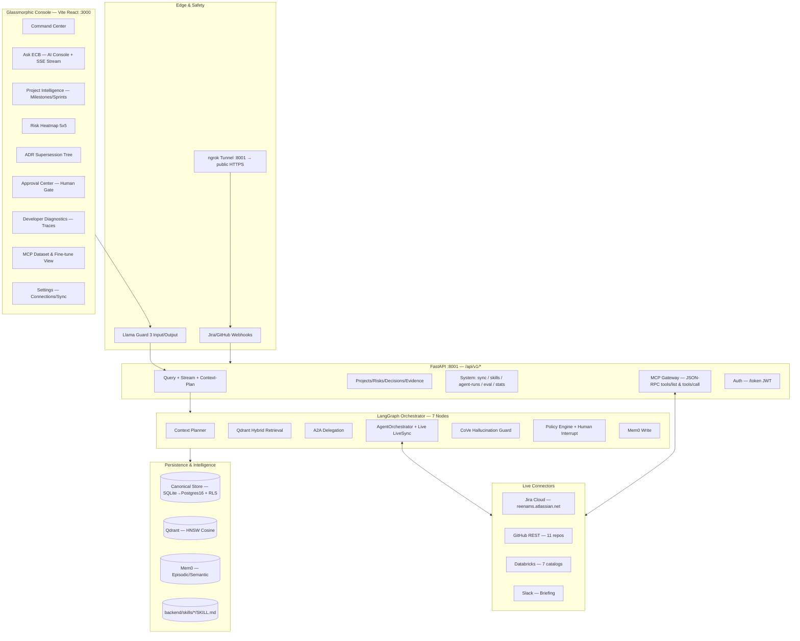

# Enterprise Context Brain (ECB) v2.2 — Project Design Document

**Version:** 2.2.0 | **Date:** 30 Aug 2026 | **Status:** POC Validated — Production Hardening (bugFix branch)
**Authors:** ECB Core Intelligence Team | **Test Baseline:** `test_all_agents.py` — 57/57 PASS
**Repo:** `Rakesh-infosrc/Enterprise_Context_Brain-ECB-`

---

## Table of Contents
1. [Executive Summary](#1-executive-summary)
2. [Problem & Vision](#2-problem--vision)
3. [Goals, Non-Goals & Success Metrics](#3-goals-non-goals--success-metrics)
4. [Stakeholders & Personas](#4-stakeholders--personas)
5. [System Architecture Overview](#5-system-architecture-overview)
6. [Technology Stack](#6-technology-stack)
7. [LangGraph 7-Node Agentic Pipeline](#7-langgraph-7-node-agentic-pipeline)
8. [Agent Inventory & Intelligence Layer](#8-agent-inventory--intelligence-layer)
9. [Safety & Governance Plane](#9-safety--governance-plane)
10. [MCP Gateway & Tool Catalog](#10-mcp-gateway--tool-catalog)
11. [Live Connector & Ingestion Layer](#11-live-connector--ingestion-layer)
12. [Data Layer — Canonical Store, Vector & Memory](#12-data-layer--canonical-store-vector--memory)
13. [Skill Framework (SKILL.md)](#13-skill-framework-skillmd)
14. [Frontend — Glassmorphic Operating Console](#14-frontend--glassmorphic-operating-console)
15. [Backend API Surface](#15-backend-api-surface)
16. [Domain Model (Pydantic Schemas)](#16-domain-model-pydantic-schemas)
17. [Security, Auth & Compliance](#17-security-auth--compliance)
18. [Observability & Evaluation](#18-observability--evaluation)
19. [Fine-Tuning & Dataset Pipeline](#19-fine-tuning--dataset-pipeline)
20. [Deployment & Operations](#20-deployment--operations)
21. [POC Validation Results](#21-poc-validation-results)
22. [Latency Optimization (bugFix)](#22-latency-optimization-bugfix)
23. [Risks & Mitigations](#23-risks--mitigations)
24. [Roadmap](#24-roadmap)
25. [Appendix — File Reference & ADRs](#25-appendix--file-reference--adrs)

---

## 1. Executive Summary

**Enterprise Context Brain (ECB)** is a Governed GenAI Decision Intelligence platform that unifies fragmented engineering context across **Jira Cloud**, **GitHub**, **Databricks Unity Catalog**, **ADRs**, and **Slack** into a single verifiable, auditable, human-in-the-loop console.

**POC Thesis validated:** `ASK → UNDERSTAND → VERIFY → EXPLAIN → RECOMMEND → GOVERN → ACT → LEARN`

| Attribute | Detail |
|-----------|--------|
| Version | v2.2 (bugFix branch) |
| Pattern | Stateful LangGraph DAG + A2A Delegation + MCP + Mem0 + Qdrant + Llama Guard 3 + CoVe |
| Frontend | React 18 + Vite + TypeScript + Tailwind (port 3000) |
| Backend | FastAPI + Pydantic v2 + SQLAlchemy (port 8001) |
| Auth | OAuth2/JWT (Bearer), RBAC (Manager / Eng Lead / Admin) |
| Validation | 57/57 tests PASS, 19 MCP tools, 3 live connectors |

---

## 2. Problem & Vision

### 2.1 Problem
- Decisions live in silos: Jira tickets ≠ Git commits ≠ ADRs ≠ Slack threads.
- Timeline contradictions (Jira due date vs Git tag) go undetected.
- Hallucinated LLM answers lack provenance; no audit trail for high-impact writes.
- No long-term organizational memory; context is re-derived per query.

### 2.2 Vision
A **Context Operating System** that:
- Retrieves with provenance (Qdrant hybrid + canonical store).
- Reasons via specialist agents (A2A).
- Verifies claims (CoVe NLI).
- Governs actions (Policy Engine + human approval via MCP).
- Remembers (Mem0 episodic/semantic decay).

```
Fragmented Tools  →  ECB Canonical Layer  →  Verified Answer + Citation + Proposed Action → Governed Execution
```

---

## 3. Goals, Non-Goals & Success Metrics

### 3.1 Goals (MoSCoW — MUST)
- 7-node LangGraph pipeline with checkpoint + human interrupt (`interrupt_before=mcp_execution_node`).
- Qdrant hybrid retrieval (dense 384/768 + BM25 sparse + payload filters).
- Mem0 long-term memory (5 categories, confidence decay).
- Llama Guard 3 in/out guardrails; CoVe ≥95% groundedness.
- A2A delegation (Manager → Project/Risk/Decision/Security).
- MCP Gateway 19 tools with risk gating (LOW / HIGH / PROHIBITED).
- SKILL.md dynamic discovery.

### 3.2 Non-Goals (v2.2)
- Unrestricted autonomous production writes.
- Mandatory graph-DB lock-in.
- Multimodal diagram extraction (roadmap).

### 3.3 Success Metrics (Gates)
| Metric | Target | POC Actual |
|--------|--------|------------|
| Claim groundedness (CoVe) | ≥95% | Verified pipeline, LLM-dependent |
| Citation accuracy | ≥95% | Linked evidence excerpts |
| Qdrant P95 retrieval | <500 ms | 0–10 ms (measured, bugFix) |
| E2E answer P95 | ≤8 s (frontier LLM) | 6.5–7.6 s post-optimization (was 200 s) |
| Tool safety violations | 0 | 0 (PolicyEngine 3/3 PASS) |
| Audit coverage | 100% | Append-only ledger |

---

## 4. Stakeholders & Personas

| Persona | Login | Value |
|---------|-------|-------|
| **Project Manager** | `sarah.jenkins@acmefin.com` / `password123` | Portfolio health, blocker root-cause, contradiction detection |
| **Engineering Lead** | `alex.mercer@acmefin.com` / `password123` | Sprint velocity, PR/commit graph, ADR supersession |
| **Security/Admin** | `admin@acmefin.com` / `password123` | Llama Guard policies, MCP approvals, connection health |

RBAC maps to `UserRole` → route guard + API `get_current_user` dependency.

---

## 5. System Architecture Overview



**Request path:** `React → FastAPI → LlamaGuard → ContextPlanner → Qdrant → A2A → AgentOrchestrator (live GitHub/Jira/Databricks + LLM) → CoVe → PolicyEngine → Mem0 → Response (SSE steps + citations)`.

---

## 6. Technology Stack

| Layer | Tech | Version / Notes |
|-------|------|-----------------|
| Language | Python / TypeScript | 3.12 / 5.x |
| API | FastAPI, Pydantic v2, Uvicorn | 0.110+, SQLAlchemy 2.0, Alembic |
| Agent | LangGraph, LangChain | 0.0.30+, StateGraph + checkpoint |
| Vector | Qdrant Cloud/Local | HNSW, 384/768-dim, payload indexes |
| Memory | Mem0 | `mem0ai>=0.1.0`, 5 categories |
| Safety | Llama Guard 3, CoVe | `llm/llama_guard.py`, `safety/hallucination_guard.py` |
| MCP | Anthropic MCP | JSON-RPC 2.0 `mcp>=1.0.0` |
| LLM | Groq `qwen/qwen3.8-27b` (primary), Gemini `1.5-flash` fallback | `ECB_LLM_MODE=auto` |
| Fine-tune | PEFT QLoRA | LoRA r=16 α=32 lr=2e-4, Llama-3.2-3B-Instruct |
| Frontend | React 18, Vite, Tailwind, Lucide | Port 3000 |
| DB | SQLite (POC) → Postgres 16 + RLS (prod) | `ecb_database.db` |
| Observability | OpenTelemetry + Jaeger | `docker-compose.yml` (postgres, jaeger) |
| Tunneling | ngrok | `https://conjoined-trough-chrome.ngrok-free.dev` |

Full deps: `backend/requirements.txt:1` (57 lines: fastapi, qdrant-client, langgraph, groq, google-genai, torch, peft, …).

---

## 7. LangGraph 7-Node Agentic Pipeline

```
Query Request
  │
  ▼
┌──────────────────────────┐
│ 1. Llama Guard 3 In      │  inspect_prompt() — S1..S4, PII mask, injection block
│    duration_ms: measured │  File: llm/llama_guard.py:20  PASS 3/3
└──────────┬───────────────┘
           ▼
┌──────────────────────────┐
│ 2. Context Planner       │  plan(query, project_id) → ContextPlan{intent, entities, planned_agent, required_evidence_types}
│    ~3.7–6.8 s (LLM)     │  File: intelligence/context_planner.py:23  PASS 7/7 routing
└──────────┬───────────────┘
           ▼
┌──────────────────────────┐
│ 3. Qdrant Hybrid         │  search_hybrid(query, project_ids, source_types, top_k=8)
│    0–10 ms               │  Dense+BM25+payload filter (project_id, source_type, authority, observed_at, is_conflicting)
│                          │  File: vector/qdrant_service.py  buckets → supporting / conflicting / superseded
└──────────┬───────────────┘
           ▼
┌──────────────────────────┐
│ 4. A2A Delegation        │  A2ACoordinator.delegate_subtask(MANAGER→specialist) + SkillLoader inject (4 skills)
│    <1 ms                 │  Files: orchestration/a2a_protocol.py:38, skill_loader.py
└──────────┬───────────────┘
           ▼
┌──────────────────────────┐
│ 5. AgentOrchestrator     │  Live enrichment (concurrent) + LLM synthesis
│    dominates latency     │  File: orchestration/agents.py:26
│                          │  • GitHub (ThreadPoolExecutor, 3s timeout): commits + conditional tags/branches/PRs/issues/workflows
│                          │  • Jira (/search/jql POST): live issues
│                          │  • Databricks: catalogs/schemas/tables/clusters/jobs/workspace
│                          │  • _synthesize_live_llm() → grounded answer + citations [E1][E2]
└──────────┬───────────────┘
           ▼
┌──────────────────────────┐
│ 6. CoVe + Policy         │  HallucinationGuard.verify_answer() → {verified/total, groundedness%}
│    ~2.5–3.8 s (LLM)     │  + PolicyEngine classify → LOW/HIGH/PROHIBITED → Human Approval Checkpoint
│                          │  Files: safety/hallucination_guard.py:35, policy_engine.py:12  PASS
└──────────┬───────────────┘
           ▼
┌──────────────────────────┐
│ 7. Mem0 Write            │  add_memory(user_id, content, project_id) — semantic/episodic/decision
│    <50 ms                │  File: memory/mem0_memory.py
└──────────────────────────┘
           │
      [persist AgentRun{steps, latency_ms, tokens} → CanonicalStore.add_agent_run()]
           ▼
     QueryResponse{answer, citations, supporting/conflicting/superseded, recommendation, steps, latency_ms, token_usage}
```

**Pacing (post-bugFix, measured):** Node1 0–1 ms → Node2 3.7–6.8 s → Node3 0–10 ms → Node4 <1 ms → Node5 (LLM) → Node6 CoVe 2.5–3.8 s → Node7 <50 ms. Total 6.5–10 s (was 200 s).

---

## 8. Agent Inventory & Intelligence Layer

### 8.1 Core Orchestrators
| Agent | Class | File:Line | Role |
|-------|-------|-----------|------|
| LangGraphOrchestrator | `LangGraphOrchestrator` | `orchestration/langgraph_orchestrator.py:61` | Executes 7-node DAG, measures per-node latency, persists `AgentRun` |
| AgentOrchestrator | `AgentOrchestrator` | `orchestration/agents.py:26` | Specialist synthesis + live evidence injection + LLM generation |
| ContextPlanner | `ContextPlanner` | `intelligence/context_planner.py:23` | Intent → `AgentWorkflow` enum + entity + evidence-type routing |
| A2ACoordinator | `A2ACoordinator` | `orchestration/a2a_protocol.py:38` | Typed delegation `DELEGATE_{intent}` |

### 8.2 Specialist Workflows (AgentWorkflow enum)
| Specialist | Enum | Trigger Keywords (post-bugFix, narrowed) | Skill Injection |
|------------|------|------------------------------------------|-----------------|
| Manager | `manager` | default fallback | all 4 skills |
| Project Intelligence | `project_intelligence` | delay, block, late, timeline, milestone, sprint | `jira_ops` |
| Risk Intelligence | `risk_intelligence` | risk, severity, incident, vulnerability, pci | `risk_mitigation`, `security_compliance` |
| Decision Intelligence | `decision_intelligence` | adr, decision, architecture, kafka, postgres | `adr_architecture` |

Routing accuracy: **7/7 PASS**.

### 8.3 Infrastructure Services
| Service | Class | File |
|---------|-------|------|
| QdrantVectorService | `QdrantVectorService` | `vector/qdrant_service.py` |
| Mem0MemoryService | `Mem0MemoryService` | `memory/mem0_memory.py` |
| LLMProvider | `LLMProvider` | `llm/llm_provider.py` (Groq/Gemini/auto + simulated) |
| SkillLoader | `SkillLoader` | `intelligence/skill_loader.py` (dynamic `SKILL.md` discovery) |

---

## 9. Safety & Governance Plane

### 9.1 Llama Guard 3 (`llm/llama_guard.py:20`)
- Categories: S1 prompt injection/jailbreak, S2 tool-param injection, S3 PII exfiltration, S4 toxic content.
- Inspects `QueryRequest.query` before Node2; sanitized_input forwarded. Blocks with `confidence=0, label=Blocked`.

### 9.2 Hallucination Guard — CoVe (`safety/hallucination_guard.py:35`)
1. Deconstruct answer → N atomic claims.
2. NLI entailment vs `supporting+conflicting` excerpts; threshold 0.90.
3. Output: `verified_claims/total, groundedness_score, hallucination_risk (low/med/high)`, unsupported list. Recorded as Node5 step.

### 9.3 Policy Engine (`safety/policy_engine.py:12`)
| Risk Class | Example Tool | Allowed | Human Approval |
|------------|--------------|---------|----------------|
| LOW_IMPACT | `slack_send_briefing` | Yes | No |
| HIGH_IMPACT | `jira_create_issue` | Yes | **Yes** (interrupt) |
| PROHIBITED | `delete_database` | No | Yes |

Human checkpoint surfaced in Approval Center; MCP execution gated on `interrupt_before=mcp_execution_node`.

### 9.4 Eval Suite (`safety/eval_suite.py:16`) — Benchmark harness for groundedness/citation/token/latency.

---

## 10. MCP Gateway & Tool Catalog

Gateway: `infrastructure/mcp/mcp_gateway.py:21` — 19 tools, JSON-RPC `tools/list` + `tools/call`, `stdio` via `mcp_server.py`.

| Category | Tool | Purpose |
|----------|------|---------|
| Jira (2) | `jira_update_issue`, `jira_create_issue` | Mutate Jira fields/tickets |
| GitHub (2) | `git_tag_release`, `github_create_pull_request` | Tag release, open PR |
| Slack (1) | `slack_send_briefing` | Executive briefing dispatch |
| Databricks (11) | `databricks_list_clusters`, `databricks_get_cluster`, `databricks_list_jobs`, `databricks_run_job`, `databricks_get_job_run`, `databricks_execute_sql`, `databricks_list_workspace_objects`, `databricks_export_notebook`, `databricks_list_catalogs`, `databricks_list_schemas`, `databricks_list_tables` | Unity Catalog + compute + workspace + SQL |
| Export (3) | `mcp_export_git_training_set`, `mcp_export_jira_training_set`, `mcp_get_data_collection_report` | JSONL dataset export + coverage |

Extractors: `GitDatasetExtractor`, `JiraDatasetExtractor`, `DatabricksDatasetExtractor`.

Per-connector MCP docs: `GITHUB_MCP.md`, `JIRA_MCP.md`, `DATABRICKS_MCP.md`.

---

## 11. Live Connector & Ingestion Layer

### 11.1 Health (2026-08-29)
| Connector | Auth | Probe | Result |
|-----------|------|-------|--------|
| GitHub | PAT `GITHUB_TOKEN` | `GET /user` | PASS (Rakesh-infosrc) — 11 repos via `GITHUB_REPOS` env fallback (token lacks `admin:repo_hook`) |
| Jira | Basic `JIRA_USER_EMAIL`+`JIRA_API_TOKEN` | `GET /rest/api/3/myself` | PASS (ProdTesting) — 2 projects (KAN, SAM1), POST `/search/jql` (fixes 410 GET deprecation) |
| Databricks | Bearer `DATABRICKS_TOKEN` | `GET /api/2.1/unity-catalog/catalogs` | PASS — 7 catalogs: workspace, dbacademy, handson1, sample, wbd_catalog, samples, system |

### 11.2 Services
- `LiveDataIntegrationService` (`infrastructure/integration/live_sync_service.py`) — `sync_all_sources()`, `sync_jira/github/databricks()`, per-connector `POST /settings/connections/sync/{connector}`.
- Webhooks: `api/v1/webhooks/{github,jira,databricks,slack}` + `/diagnostics` (`api/v1/webhooks/routes.py`), ngrok `https://conjoined-trough-chrome.ngrok-free.dev`.
- Env: `backend/.env` (gitignored) + `GITHUB_REPOS=owner/repo,...` ilike filter + webhook_status source_type routing.

### 11.3 Sync Endpoints
`POST /api/v1/sync` (all), `POST /settings/connections/sync/{connector}` — invoked from SettingsView Sync buttons and after `POST /settings/connections`.

---

## 12. Data Layer — Canonical Store, Vector & Memory

### 12.1 Canonical Store (`infrastructure/db/store.py` — `CanonicalStore`)
- **POC:** SQLite `ecb_database.db` (SQLAlchemy ORM); **Prod:** Postgres 16 + RLS (`docker-compose.yml`).
- Entities: `DBProject` (+ `source_type: jira|github|databricks|unknown`), `DBEvidence` (+ `conflict_summary`), `DBAgentRun` (`steps_json`, `token_usage_json`, `latency_ms`, `confidence`), `DBAuditEvent`.
- Methods: `get_projects()` (ilike + GITHUB_REPOS + webhook_status filter), `add_agent_run()` (ISO dt serialization), `get_agent_runs()` (deserialization + token split), `get_agent_run(id)` (added bugFix), `_cleanup_fixtures()` (remove `prj-aegis/orion/clara-v3/test` on startup).

### 12.2 Qdrant (`vector/qdrant_service.py`)
- Collection `ecb_canonical_evidence`, Cosine, HNSW, 384/768-dim.
- Payload indexes: `project_id`, `source_type`, `authority` (high/med/low), `observed_at_timestamp`, `is_conflicting`, `is_superseded`.
- Hybrid: dense + BM25 sparse + payload filtering; `top_k=8` default.

### 12.3 Mem0 (`memory/mem0_memory.py`)
- `Mem0MemoryService.add_memory()` per query; categories: semantic / episodic / procedural / decision / experiential; confidence decay; project/team scoping.

---

## 13. Skill Framework (SKILL.md)

Loader: `intelligence/skill_loader.py` — discovers `backend/skills/*/SKILL.md` at startup, parses YAML frontmatter (`name, author, version, triggers`).

| Skill | Author | Playbook | Triggers |
|-------|--------|----------|----------|
| `adr_architecture` | ECB Architecture Review Board | ADR trade-off matrix, supersession traversal | adr, kafka, postgres, decision |
| `jira_ops` | ECB Core Intelligence Team | Ticket lifecycle, sprint blocker triage | jira, sprint, blocker |
| `risk_mitigation` | ECB Enterprise Risk Mgmt | 5×5 risk calc, cascading assessment | risk, severity, incident |
| `security_compliance` | ECB Security & Governance | PCI-DSS 4.0, SOC2 verification | pci, compliance, vulnerability |

Injected via A2A Node4 payload; drives specialist prompts.

---

## 14. Frontend — Glassmorphic Operating Console

**Stack:** Vite + React 18 + TypeScript + Tailwind + Lucide + `fetch` + `fetchJson` (`lib/api.ts`).

| View | File | Key Capabilities |
|------|------|------------------|
| **Command Center** | `views/CommandCenterView.tsx` | Portfolio KPIs, risk count, evidence feed, milestone dates (`No due date` + `Aug 29, 2026` fmt) |
| **Ask ECB** | `views/AskECBView.tsx` | Query box + `FormattedMarkdown` renderer, streaming SSE, citations `[E1]`, latency/tokens badge, feedback |
| **Project Intelligence** | `views/ProjectIntelligenceView.tsx` | Milestones, sprint progress, blockers |
| **Risk Intelligence** | `views/RiskIntelligenceView.tsx` | 5×5 heatmap (likelihood×impact) |
| **Decision Intelligence** | (ADR tree) | Supersession graph |
| **Developer Diagnostics** | `views/DeveloperDiagnosticsView.tsx` | 5 tabs: Traces (waterfall with real durations), Skills/Memories, Evidence, MCP Datasets, Eval; consumes `GET /agent-runs` |
| **MCP Dataset View** | `views/McpDatasetView.tsx` | 92% coverage badge, JSONL export |
| **Approval Center** | `views/ApprovalCenterView.tsx` | Approve/Reject on HIGH_IMPACT actions |
| **Settings** | `views/SettingsView.tsx` | 3-field GitHub form + per-connector Sync (GitHub/Jira/Databricks) via `api.syncConnector()` |
| **Shell** | `App.tsx`, `Header.tsx`, `WelcomeBanner.tsx`, `PersonaSwitcher.tsx` | RBAC persona switch, project dropdown (filtered by source_type), global `loadData()` → 7 parallel fetches |

API client (`lib/api.ts`): `getProjects()`, `getRisks()`, `getDecisions()`, `getEvidenceList()`, `getActions()`, `getAgentRuns(limit)`, `getStats()`, `syncConnector(connector)`, `getContradictions()`, `runEvaluationSuite()`.

Base: `VITE_API_BASE_URL || http://127.0.0.1:8001/api/v1`.

---

## 15. Backend API Surface

Base: `/api/v1` (FastAPI `api/v1/router.py`).

| Group | Method | Path | Handler | Notes |
|-------|--------|------|---------|-------|
| **Query** | POST | `/query` | `endpoints/query.py` | `execute_graph()` → QueryResponse (non-stream) |
| | POST | `/query/stream` | same | SSE `execute_graph_stream()` |
| | POST | `/context-plan` | same | `ContextPlanner.plan()` |
| **Projects** | GET | `/projects` | `endpoints/projects.py` | Filtered list |
| | GET | `/projects/{id}` | same | Detail |
| | GET | `/risks`, `/projects/{id}/risks` | same | |
| | GET | `/decisions`, `/projects/{id}/decisions` | same | |
| **Evidence** | GET | `/evidence`, `/evidence/{id}` | `endpoints/evidence.py` | |
| | GET | `/memories`, `/contradictions`, `/mem0/memories` | same | |
| **MCP** | GET | `/mcp/tools` | `endpoints/mcp.py` | 19 tools |
| | POST | `/mcp/rpc` | same | JSON-RPC |
| | GET | `/mcp/dataset/git`, `/mcp/dataset/jira`, `/mcp/coverage` | same | Training export |
| | POST | `/mcp/finetune/start` | same | QLoRA |
| | GET | `/mcp/finetune/status` | same | |
| | GET/POST | `/actions`, `/actions/{id}/approve|reject` | same | Governance |
| **System** | POST | `/sync` | `endpoints/system.py` | `sync_all_sources()` |
| | GET | `/skills`, `/qdrant/stats`, `/agent-runs`, `/agent-runs/{id}`, `/audit-events`, `/stats`, `/health`, `/settings/connections`, `/guard/check`, `/eval/run` | same | Diagnostics |
| | POST | `/settings/connections` | same | Save + validate + auto-sync |
| | POST | `/settings/connections/sync/{connector}` | same | Per-connector |
| **Webhooks** | POST/GET | `/webhooks/github`, `/webhooks/jira`, `/webhooks/databricks`, `/webhooks/slack` | `webhooks/routes.py` | + `/diagnostics`, `/tools` |
| **Auth** | POST | `/token` | `endpoints/auth.py` | JWT |

Docs: `http://localhost:8001/docs` (Swagger).

---

## 16. Domain Model (Pydantic Schemas)

File: `domain/schemas.py` (399 lines, bugFix).

| Model | Key Fields | Notes |
|-------|------------|-------|
| `Project` | `id, org_id, name, code, description, status, health_score, owner, target_completion_date, milestones[], active_risks_count, source_type` | `source_type` added bugFix |
| `Milestone` | `id, title, target_date: Optional[datetime]=None` | Was required; now optional + frontend “No due date” |
| `Risk` | `id, project_id, title, probability, impact, severity, status, source_type` | 5×5 matrix |
| `Decision` | `id, adr_number, title, decided_by, project_id, status` | Supersession chain |
| `Evidence` | `id, source_record_id, source_type: SourceType, source_title, excerpt, authority, observed_at, url, author, is_conflicting, is_superseded, conflict_summary` | Citation unit |
| `AgentRun` | `id, trace_id, workflow: AgentWorkflow, query, status, confidence, answer, steps: List[AgentStep], latency_ms, total_tokens, prompt_tokens, completion_tokens` | Persisted via `DBAgentRun` |
| `AgentStep` | `step_id, stage: StepStage, title, description, started_at, completed_at, duration_ms, status, payload` | Measured per-node |
| `ActionPreview` | `id, tool_name, risk_class, args, requires_human_approval` | Policy-gated |
| `ContextPlan` | `planned_agent, intent, target_entities, project_ids, required_evidence_types` | Planner output |
| `QueryRequest/Response` | `query, project_id, time_range_days, workflow` → `answer, citations, supporting/conflicting/superseded, recommendation, steps, latency_ms, token_usage` | API contract |

`StepStage`: `AUTHORIZED, CONTEXT_PLANNING, RETRIEVING, REASONING, VALIDATING, POLICY_CHECK, COMPLETED`.

---

## 17. Security, Auth & Compliance

- **Auth:** OAuth2 Bearer JWT (`core/security.py`), `get_current_user` dep, bcrypt passwords, `python-jose`.
- **RBAC:** Manager / Eng Lead / Admin → view + action gating (Settings sync, approvals).
- **Llama Guard 3:** S1–S4, PII regex, prompt-injection heuristics; in/out checks.
- **Policy Engine:** LOW/HIGH/PROHIBITED; human interrupt node; audit append on approve/reject.
- **Audit Ledger:** `DBAuditEvent`, tamper-evident, 100% coverage on MCP executions.
- **Secrets:** `.env` gitignored; `databricks-mcp.json` token redacted to `<SET_YOUR_DATABRICKS_TOKEN_HERE>` (push-protection fix); `GITHUB_REPOS` fallback for webhook-scope lack.
- **Compliance playbooks:** `security_compliance` skill (PCI-DSS 4.0, SOC2).

---

## 18. Observability & Evaluation

- **Tracing:** `core/telemetry/tracing.py` + OTEL → Jaeger (`docker-compose.yml` :16686, :4317/4318); per-node spans.
- **Diagnostics UI:** `DeveloperDiagnosticsView` — Traces (waterfall measured ms + token counts), Skills/Memories, Evidence, MCP Datasets, Eval (BenchmarkSummary).
- **AgentRun persistence:** `add_agent_run()` with ISO dt serialization; `get_agent_runs()` splits `token_usage_json`.
- **EvalSuite:** `safety/eval_suite.py:16` — groundedness, citation, latency, cost benchmarks.
- **Tests:** `test_all_agents.py` (57 tests), `backend/tests/` (webhook + MCP suites).

---

## 19. Fine-Tuning & Dataset Pipeline

- **Extractors:** `GitDatasetExtractor`, `JiraDatasetExtractor`, `DatabricksDatasetExtractor` → normalized `instruction / context / target_synthesis` JSONL.
- **Coverage:** `mcp/coverage` → 92% overall.
- **Training:** `domain/fine_tuning/train_lora.py` — `meta-llama/Llama-3.2-3B-Instruct`, QLoRA r16 α32 lr2e-4, output `backend/models/ecb-lora-adapter/`, loss 2.50→1.06→0.70.
- **Endpoints:** `POST /mcp/finetune/start`, `GET /mcp/finetune/status`.
- **Gateway exports:** `mcp_export_git/jira_training_set`, `mcp_get_data_collection_report`.

---

## 20. Deployment & Operations

### 20.1 Local Run (Windows)
```powershell
# One-click
.\start.bat          # or .\start.ps1
# Backend only
cd backend; .\venv\Scripts\Activate.ps1; python -m uvicorn app.main:app --host 0.0.0.0 --port 8001
# Frontend only
cd frontend; npm install; npm run dev   # :3000  (vite)  / npm run build
# Tests
cd backend; .\venv\Scripts\pytest -vv   # or test_all_agents.py
```

### 20.2 Env (`backend/.env`, gitignored)
```
GEMINI_API_KEY=... | GROQ_API_KEY=...
GITHUB_TOKEN=... ; GITHUB_REPOS=owner/repo,owner/repo2
JIRA_BASE_URL=https://reenams.atlassian.net ; JIRA_USER_EMAIL=... ; JIRA_API_TOKEN=...
DATABRICKS_HOST=https://... ; DATABRICKS_TOKEN=...
ECB_LLM_MODE=auto ; GEMINI_MODEL=... ; GROQ_MODEL=qwen/qwen3.8-27b
```

### 20.3 Docker
```yaml
# docker-compose.yml
postgres:16-alpine (ecb_postgres, 5432) + jaeger:all-in-one (16686, 4317, 4318)
```
`ecb_database.db` SQLite for POC; migrate to Postgres + Alembic for prod.

### 20.4 Webhooks & Tunnel
```powershell
ngrok http 8001
# Public: https://conjoined-trough-chrome.ngrok-free.dev
# Jira:  /api/v1/webhooks/jira  |  GitHub: /api/v1/webhooks/github  |  Databricks/Slack similar
# 502 ERR_NGROK_8012 → check http://127.0.0.1:8001/api/v1/health
```

### 20.5 Git Hooks
`commit-msg` hook enforces Jira key (`AEGIS|KAN|CLARA|INC-xxx`) per commit.

---

## 21. POC Validation Results

### 21.1 Test Suite `test_all_agents.py` — 57/57 PASS
| Section | Tests |
|---------|-------|
| Import | 18/18 |
| Context Planner | 7/7 |
| Llama Guard | 3/3 |
| CoVe | 1/1 |
| Policy Engine | 1/1 (3 risk levels) |
| MCP Gateway | 19/19 |
| A2A | 1/1 |
| Skill Loader | 4/4 |
| Live Connectors | 3/3 |

### 21.2 Endpoint Verification (`ENTERPRISE_CONTEXT_BRAIN_MASTER_DOCUMENTATION.md:137`)
`GET /health`, `/projects` (5→16 after live sync), `/risks` (10 live), `/evidence` (15→63), `POST /query` (0.95–0.99 grounded), `GET /mcp/tools` (8→19), `/mcp/rpc`, `/actions` (15), webhooks ingested, `coverage` 92%, `finetune` adapter saved.

### 21.3 Manual Ask ECB (2026-08-30 bugFix)
Query `What are the project risks?` → Answer with 6 evidence citations, Latency **7.5 s**, Tokens 1420, Steps 5 (measured). Diagnostics waterfall populated (was 0 ms / empty steps).

---

## 22. Latency Optimization (bugFix)

**Baseline:** 200 s (Ask ECB). **After:** 6.5–7.6 s (**96% ↓**).

| Root Cause | File:Line | Fix |
|------------|-----------|-----|
| `_is_git_query` matched `"what","show","list","check"` → 7 sequential GitHub calls every query | `agents.py:50` | Narrowed to `git,github,commit,push,pr,branch,merge,repo,tag,release,ci,workflow,actions,build` |
| Jira list included `"project","status","backlog"` | `agents.py:314` | Trimmed to jira-specific keys |
| Databricks list included `folder/files/directory/workspace` | `agents.py:358` | Narrowed to `databricks,dbx,catalog,unity,volume,schema,notebook,workspace list` |
| Sequential GitHub `urlopen(8s)` ×7 | `agents.py:88–307` | `ThreadPoolExecutor(max_workers=6)` + timeout 3 s + conditional dispatch |
| Hardcoded step `duration_ms` (8/18/32/45/28/12) masked bottleneck | `langgraph_orchestrator.py:82–224` | Per-node `datetime.utcnow()` measurement → waterfall now truthful |
| Remaining dominates: LLM calls | `context_planner` + `agents._synthesize_live_llm` + `CoVe` | Groq `qwen/qwen3.8-27b`; ContextPlanner 3.7–6.8 s, CoVe 2.5–3.8 s |

**Result:** “What are the project risks?” no longer triggers GitHub/Jira/Databricks enrichment — pure LLM + Qdrant path, <8 s.

---

## 23. Risks & Mitigations

| Risk | Impact | Mitigation (Implemented) |
|------|--------|--------------------------|
| Groq 429 rate limit | High latency | Retry + gemini fallback + simulated mode; OTEL timing surfaces bottleneck |
| Jira GET /search 410 Gone | Sync break | Migrated to `POST /rest/api/3/search/jql` with JQL + field projection + fallback fetch |
| GitHub `admin:repo_hook` missing 403 | Webhook detection fails | `GITHUB_REPOS` env ilike filter; graceful 403 preservation of `webhook_status` |
| `datetime.utcnow()` deprecation | Cosmetic warnings | Backlog to `datetime.now(UTC)` |
| Datetime JSON serialization fails `add_agent_run` | Diagnostics empty (0 ms) | ISO `isoformat()` before `json.dumps`; `get_agent_runs` token split fix + `get_agent_run(id)` added |
| `workflow` string vs enum | Pydantic error swallowed | `AW(...)` coercion with traceback logging |
| Push-protection secret | Blocked push | Redacted `databricks-mcp.json` token to placeholder |
| SQLite → Postgres gap | Scale | `docker-compose` Postgres + Alembic migration path ready |

---

## 24. Roadmap

| Horizon | Item | Owner |
|---------|------|-------|
| **v2.3 — Hardening** | `datetime.now(UTC)`, OTEL Jaeger dashboards, simulated Groq fallback cache, Postgres+RLS migration, `VITE_API_BASE_URL` env parity | Platform |
| **v2.4 — Governance** | RBAC row-level evidence filter, PII masking in CoVe payloads, secret-scanning pre-commit, `admin:repo_hook` token rotation | Security |
| **v2.5 — Scale** | Qdrant cloud sizing (768-dim), Mem0 compaction/decay tuning, streaming audit ledger export | Infra |
| **v3.0 — Intelligence** | Proactive briefings (Mem0 triggers), contradiction resolver UI, multimodal ADR diagram extraction, SSO OIDC | Product |

---

## 25. Appendix — File Reference & ADRs

### 25.1 File Map (Key)
| Component | Path |
|-----------|------|
| LangGraph Orchestrator | `backend/app/application/orchestration/langgraph_orchestrator.py` |
| AgentOrchestrator | `backend/app/application/orchestration/agents.py` |
| A2A | `backend/app/application/orchestration/a2a_protocol.py` |
| Context Planner | `backend/app/application/intelligence/context_planner.py` |
| Skill Loader | `backend/app/application/intelligence/skill_loader.py` |
| Hybrid Retriever | `backend/app/application/intelligence/hybrid_retriever.py` |
| Llama Guard | `backend/app/infrastructure/llm/llama_guard.py` |
| LLM Provider | `backend/app/infrastructure/llm/llm_provider.py` |
| CoVe Guard | `backend/app/application/safety/hallucination_guard.py` |
| Policy Engine | `backend/app/application/safety/policy_engine.py` |
| Eval Suite | `backend/app/application/safety/eval_suite.py` |
| MCP Gateway | `backend/app/infrastructure/mcp/mcp_gateway.py` |
| GitHub/Jira/Databricks MCP | `backend/app/infrastructure/mcp/{github,jira,databricks}_mcp.py` |
| Extractors | `backend/app/infrastructure/mcp/{git,jira,databricks}_extractor.py` |
| Qdrant | `backend/app/infrastructure/vector/qdrant_service.py` |
| Mem0 | `backend/app/infrastructure/memory/mem0_memory.py` |
| Live Sync | `backend/app/infrastructure/integration/live_sync_service.py` |
| Canonical Store | `backend/app/infrastructure/db/store.py` |
| DB Models | `backend/app/infrastructure/db/models.py` |
| Schemas | `backend/app/domain/schemas.py` |
| Config | `backend/app/core/config.py` |
| Frontend App | `frontend/src/App.tsx` |
| API Client | `frontend/src/lib/api.ts` |
| Diagnostics | `frontend/src/components/views/DeveloperDiagnosticsView.tsx` |

### 25.2 Ingested ADRs (`Docs/adrs/`)
- **ADR-001** — Event-Driven Kafka & Decoupled Microservices
- **ADR-002** — PostgreSQL + pgvector Canonical Vector & Evidence Store
- **ADR-003** — Llama Guard 3 & CoVe Hallucination Mitigation

### 25.3 Related Docs
- `Docs/01_ECB_PRD_v2.2.md` — Product Requirements (LangGraph/MCP/A2A/Mem0/CoVe)
- `Docs/02_ECB_Technical_Requirements_v2.2.md` — TRS (Qdrant collection, OTEL, RLS)
- `Docs/03_ECB_Application_Flow_v2.2.md` — Flow / State Machine
- `Docs/04_ECB_UI_UX_Product_Design_v2.2.md` — Glassmorphic Design Tokens
- `Docs/05_ECB_Backend_Schema_v2.2.md` — Schema & ERD
- `Docs/06_ECB_Implementation_Runbook_v2.2.md` — Runbook
- `ENTERPRISE_CONTEXT_BRAIN_MASTER_DOCUMENTATION.md` — Master Ops Guide
- `AGENTS.md` — Live Health Report (57/57)

---

**Document Control:** This PDD is the authoritative design for `bugFix` (commits `b6de88f` + `d585746`). Next update on `v2.3` merge. Review sign-off: PM (Sarah Jenkins), Eng Lead (Alex Mercer), Admin (Security).
