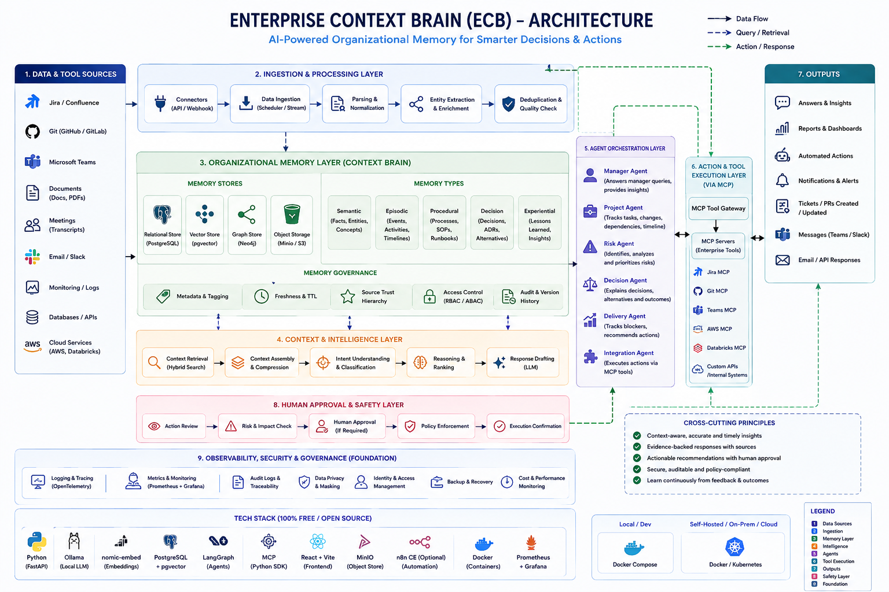
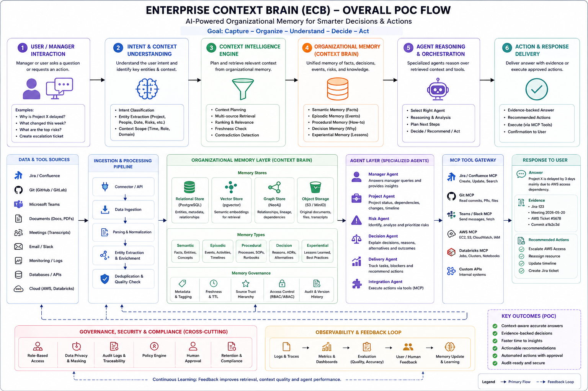
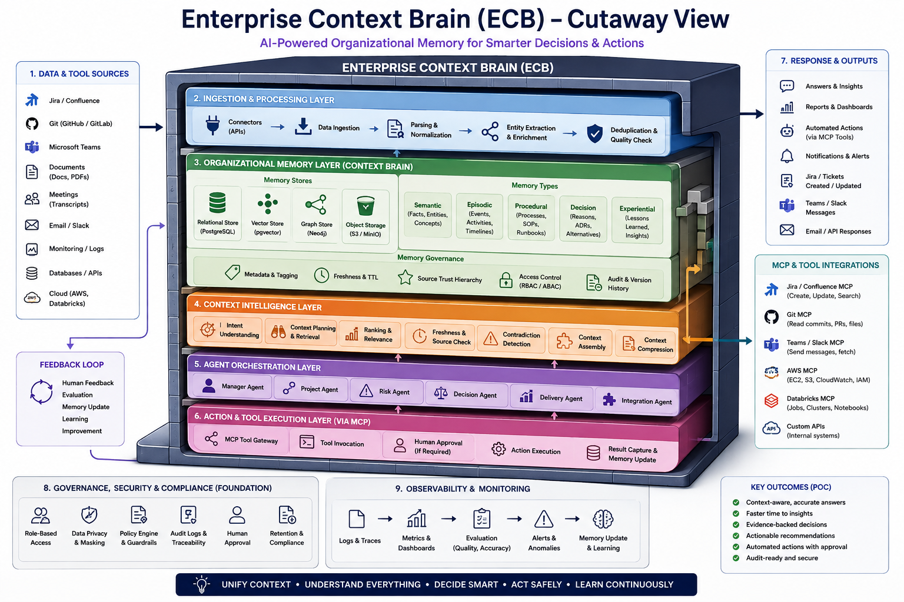
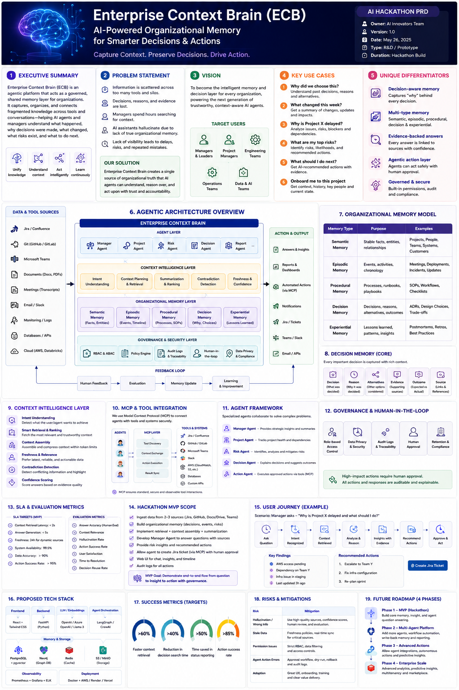

# 🧠 Enterprise Context Brain
> **Governed Organizational Memory & Agentic Decision Intelligence Platform**

[](https://fastapi.tiangolo.com/)
[](https://nextjs.org/)
[](https://github.com/pgvector/pgvector)
[](https://github.com/langchain-ai/langgraph)
[](https://modelcontextprotocol.io/)

---

## 📌 What is Enterprise Context Brain?

**Enterprise Context Brain** is a governed organizational memory and agentic decision intelligence platform. It connects fragmented enterprise information—such as project documents, Jira tickets, Git commits, meeting notes, incidents, decisions, and operational telemetry—and converts it into trusted, time-aware, evidence-backed context for AI agents.

### ❓ The Problem It Solves

Managers and engineering leads work across disconnected enterprise systems. Important context behind decisions is often buried in meeting transcripts, Jira tickets, or chat conversations.

* **Context Fragmentation**: Facts, reasons, and decisions exist in silos across Jira, Git, Teams, and documents.
* **Limitations of Traditional RAG**: Basic vector search retrieves text chunks based on semantic similarity, but lacks understanding of **decision history**, **source authority**, **freshness**, and **contradictions**.
* **Stale & Hallucinated AI Responses**: AI agents without governed context can use outdated information or make unvetted actions without human authorization.

### 💡 Why Enterprise Context Brain is Different

| Feature | Traditional AI Assistant / RAG | Enterprise Context Brain |
| :--- | :--- | :--- |
| **Focus** | Document-centric | **Decision-, project-, event-, and evidence-centric** |
| **Retrieval Strategy** | Simple top-$k$ vector similarity | **Hybrid (Vector + Structured DB + Temporal + Authority ranking)** |
| **Decision Memory** | Unstructured text snippets | **First-class structured objects (`DEC-2026-XXXX`) with supersede lineage** |
| **Conflict Resolution** | Ignores source disagreement | **Detects cross-system contradictions** (e.g. Jira status vs Chat claim) |
| **Action Execution** | Direct or ungoverned | **Risk-based Human-in-the-Loop (HITL) policy enforcement** |

---

## 🖼️ System Architecture Diagrams & Flowcharts

The following diagrams illustrate the core architecture, context pipeline, and layer interactions (located in [`./ECB/`](file:///d:/InfoServices/Hackathon/ECB)):

### 1. High-Level Architecture


### 2. Context Intelligence Flowchart


### 3. Layered Platform Architecture


### 4. Executive Overview & Data Plane


---

## 🏛️ High-Level System Architecture

```
Manager / User
      ↓
Manager Context UI (Next.js 14 / React)
      ↓
API / Agent Gateway (FastAPI)
      ↓
Agent Orchestrator (LangGraph Multi-Agent Control Plane)
 ├── Manager Supervisor Agent
 ├── Specialized Risk Agent
 ├── Decision Agent (ADR & Scope analysis)
 ├── Project Agent (Delivery & Status)
 ├── Incident Agent (Telemetry & Operations)
 └── Meeting Agent (Action item extraction)
      ↓
Context Intelligence Layer
 ├── Intent Recognition & Entity Extraction
 ├── Hybrid Retrieval (Vector pgvector + SQL Metadata)
 ├── Source Authority Ranking & Freshness Validation
 └── Cross-System Contradiction Detection
      ↓
Organizational Memory Store (5 Memory Types)
 ├── Semantic Memory (Stable facts)
 ├── Episodic Memory (Events & Milestones)
 ├── Procedural Memory (SOPs & Playbooks)
 ├── Decision Memory (Structured DEC objects)
 └── Experiential Memory (Lessons learned & outcomes)
      ↓
Governed MCP Gateway
 ├── Policy Engine (Low, Medium, High, Critical risk rating)
 ├── HITL Approval Queue
 └── Controlled Tool Execution (Jira, Git, Docs, AWS)
```

---

## 📂 Complete POC Directory & File Structure

```
enterprise-context-brain/
├── .env.example                         # Global environment variable template
├── .gitignore                           # Git ignore rules
├── docker-compose.yml                   # Container orchestration (PostgreSQL + pgvector, MinIO, FastAPI, Next.js)
├── Makefile                             # Automation shortcuts (setup, seed, run, test)
├── README.md                            # Setup guide, architecture overview, and demo script
│
├── ECB/                                 # PRD, Architecture Diagrams, and Open-Source Toolkit Docs
│   ├── ECB_AI_Hackathon_PRD.docx        # Product Requirements Document
│   ├── ECB_Architecture_Diagram.png     # Visual architecture diagram
│   ├── ECB_Flow_Chart.png               # Context intelligence flowchart
│   ├── ECB_Layer.png                    # Layered platform diagram
│   ├── ECB_overview.png                 # Executive overview screenshot
│   ├── ECB_Free_Open_Source_Toolkit_and_Build.docx # $0-cost open source build guide
│   └── ECB_Ramu_Reena_POC_Execution_Plan.docx      # 2-person hackathon execution plan
│
├── docs/                                # Project documentation & architecture schemas
│   ├── architecture_diagram.mermaid     # Context engine & agent control plane flowchart
│   ├── memory_schema.sql                # DDL for pgvector and structured organizational tables
│   └── demo_scenario_walkthrough.md     # Step-by-step instructions for the Manager Demo scenario
│
├── backend/                             # Python / FastAPI Backend & Agent Service
│   ├── Dockerfile                       # Python 3.11 environment setup
│   ├── pyproject.toml                   # Poetry / Dependencies management
│   ├── requirements.txt                 # Fallback pip requirements (LangGraph, FastAPI, pgvector, etc.)
│   ├── alembic.ini                      # Database migration configuration
│   │
│   ├── alembic/                         # Database schema migrations
│   │   ├── env.py
│   │   └── versions/
│   │
│   ├── scripts/                         # Operational & Ingestion Scripts
│   │   ├── init_db.py                   # Enable pgvector extension and create tables
│   │   ├── seed_synthetic_data.py       # Seeds synthetic dataset (Project X / KCF delay scenario)
│   │   └── run_evals.py                 # Evaluates context retrieval & answer confidence against benchmarks
│   │
│   └── app/                             # Core Application Source Code
│       ├── __init__.py
│       ├── main.py                      # FastAPI application entrypoint & middleware
│       ├── config.py                    # Settings, env vars, LLM API keys, DB URIs
│       │
│       ├── api/                         # REST & WebSocket API Endpoints
│       │   ├── __init__.py
│       │   ├── router.py                # Main API router aggregator
│       │   ├── v1/
│       │   │   ├── __init__.py
│       │   │   ├── query.py             # Manager query & streaming chat response (SSE / WS)
│       │   │   ├── context.py           # Context Engine retrieval & inspection endpoints
│       │   │   ├── decisions.py         # Structured Decision Memory CRUD & history endpoints
│       │   │   ├── approvals.py         # Pending high-impact action approvals (HITL)
│       │   │   ├── tools.py             # MCP tool invocation endpoints
│       │   │   ├── memory.py            # Organizational memory search & inspection
│       │   │   └── traces.py            # Observability & audit trail logging endpoints
│       │
│       ├── core/                        # Shared Core Utilities & System Frameworks
│       │   ├── __init__.py
│       │   ├── security.py              # RBAC/ABAC role & permission enforcement
│       │   ├── llm_factory.py           # Unified LLM client wrapper (OpenAI/Anthropic/Azure)
│       │   ├── embeddings.py            # Vector embedding generator wrapper
│       │   └── logger.py                # Structured JSON logging & tracing
│       │
│       ├── db/                          # Database Connection & Models
│       │   ├── __init__.py
│       │   ├── session.py               # Async SQLAlchemy database session manager
│       │   └── models/                  # Database Entities (ORMs)
│       │       ├── __init__.py
│       │       ├── organization.py      # Org, Team, Person, Project, Goal models
│       │       ├── memory.py            # Memory Store (Semantic, Episodic, Procedural, Experiential)
│       │       ├── decision.py          # Structured Decision Memory model (DEC-ID, Reason, Alternatives, Evidence)
│       │       ├── evidence.py          # Evidence sources (Jira ticket, ADR, commit, meeting transcript)
│       │       ├── audit.py             # Action Audit Trail & Agent execution trace logs
│       │       └── approval.py          # Human approval queue and workflow status
│       │
│       ├── memory/                      # Organizational Memory Layer
│       │   ├── __init__.py
│       │   ├── base.py                  # Base memory store interface
│       │   ├── semantic.py              # Stable facts storage & lookup
│       │   ├── episodic.py              # Event timeline & historical milestone store
│       │   ├── procedural.py            # Standard operating procedures (SOP) & operational playbooks
│       │   ├── decision.py              # Structured decision index & superseded link graph
│       │   └── experiential.py          # Lessons learned & outcome post-mortems
│       │
│       ├── context_engine/              # Context Intelligence Layer (Core Differentiator)
│       │   ├── __init__.py
│       │   ├── intent_recognizer.py     # Classifies input intent (Root Cause, Risk, Decision, Status)
│       │   ├── entity_extractor.py      # Extracts entities (Projects, Systems, Persons, Tickets)
│       │   ├── context_planner.py       # Formulates multi-source retrieval execution plan
│       │   ├── hybrid_retriever.py      # Executes hybrid search (Vector pgvector + SQL filter + Graph)
│       │   ├── freshness_validator.py   # Checks TTL, timestamp recency, and decay weights
│       │   ├── authority_ranker.py      # Ranks evidence by source trust level (System of record > Chat)
│       │   ├── contradiction_detector.py# Identifies conflicting facts across enterprise sources
│       │   ├── token_optimizer.py       # Context summarization and prompt token optimization
│       │   └── evidence_assembler.py    # Assembles final evidence packet with confidence scores
│       │
│       ├── agents/                      # Agent Control Plane (LangGraph Framework)
│       │   ├── __init__.py
│       │   ├── state.py                 # Shared Agent State schema (LangGraph TypedDict)
│       │   ├── graph.py                 # Multi-Agent StateGraph orchestrator definition
│       │   └── specialized/             # Sub-Agent Modules
│       │       ├── __init__.py
│       │       ├── manager_agent.py     # Orchestrator / Supervisor agent (Synthesizes answers)
│       │       ├── project_agent.py     # Analyzes delivery status, timelines, and dependencies
│       │       ├── risk_agent.py        # Identifies, scores, and categorizes delivery/platform risks
│       │       ├── decision_agent.py    # Explains historical ADRs, scope changes, and trade-offs
│       │       ├── meeting_agent.py     # Extracts decisions & action items from meeting notes
│       │       └── incident_agent.py    # Analyzes telemetry, downtime, and operational incidents
│       │
│       ├── mcp_gateway/                 # Model Context Protocol & Tools Integration
│       │   ├── __init__.py
│       │   ├── registry.py              # Tool registry & permission matrix
│       │   ├── executor.py              # Safe tool execution engine
│       │   └── tools/                   # MCP Enterprise Connectors & Action Tools
│       │       ├── __init__.py
│       │       ├── jira_tool.py         # Read/Create/Update Jira issues & escalations
│       │       ├── git_tool.py          # Read Git commits, PRs, and release evidence
│       │       ├── docs_tool.py         # Fetch ADRs, specs, and S3 document artifacts
│       │       ├── collaboration_tool.py# Fetch Teams/Slack approved meeting summaries
│       │       └── aws_tool.py          # Retrieve cloud status & resource health
│       │
│       └── governance/                  # Governance, Security & HITL Approval Engine
│           ├── __init__.py
│           ├── policy_engine.py         # Evaluates action risk policy (Low, Medium, High, Critical)
│           ├── approval_manager.py      # Creates and monitors human approval requests
│           ├── prompt_defense.py        # Untrusted content & prompt injection sanitizer
│           └── audit_trail.py           # Records immutable event logs for every retrieval & action
│
└── frontend/                            # Next.js 14+ React Frontend (Manager Experience)
    ├── Dockerfile                       # Node.js environment build setup
    ├── package.json                     # Dependencies (Next.js, TailwindCSS, Lucide, Recharts)
    ├── tsconfig.json                    # TypeScript configuration
    ├── tailwind.config.js               # Dark mode & visual design system theme settings
    ├── postcss.config.js
    ├── next.config.js
    │
    ├── public/                          # Static assets, logos, and mock evidence files
    │   ├── favicon.ico
    │   └── static_docs/ font             # Sample ADRs & PDF document viewer assets
    │
    └── src/
        ├── app/                         # Next.js App Router Pages
        │   ├── layout.tsx               # Main UI shell (Sidebar, Header, Notifications)
        │   ├── page.tsx                 # Redirects to /dashboard
        │   ├── dashboard/               # Manager Executive Overview Page
        │   │   └── page.tsx             # Project status, top risks, active decisions widgets
        │   ├── chat/                    # Decision Intelligence Conversational Interface
        │   │   └── page.tsx             # Interactive agent chat with evidence & confidence badges
        │   ├── approvals/               # Human-in-the-Loop (HITL) Queue
        │   │   └── page.tsx             # Pending action reviews (e.g. Escalate AWS dependency)
        │   ├── memory/                  # Organizational Memory Browser
        │   │   └── page.tsx             # Explore Decisions, ADRs, Incidents & Timelines
        │   └── traces/                  # Observability & Audit Trail Dashboard
        │       └── page.tsx             # Graph visualization of agent steps, tools & confidence
        │
        ├── components/                  # UI Components Design System
        │   ├── common/                  # Generic UI components
        │   │   ├── Header.tsx           # Navigation header & active user role switch
        │   │   ├── Sidebar.tsx          # Main navigation bar
        │   │   ├── Badge.tsx            # Risk & confidence status badges
        │   │   ├── Modal.tsx            # Confirmation modal for HITL actions
        │   │   └── Card.tsx             # Glassmorphism container wrapper
        │   │
        │   ├── chat/                    # Chat-specific Components
        │   │   ├── ChatWindow.tsx       # Message list container with SSE streaming support
        │   │   ├── ChatInput.tsx        # Query input bar with quick prompt templates
        │   │   ├── EvidenceCard.tsx     # Accordion showing backing Jira/Git/ADR sources
        │   │   ├── ActionCard.tsx       # Interactive card recommending high-impact action
        │   │   └── ConflictNotice.tsx   # Visual indicator highlighting conflicting source data
        │   │
        │   ├── dashboard/               # Manager Dashboard Widgets
        │   │   ├── ProjectHealth.tsx    # Health indicators & milestone progress
        │   │   ├── RiskMatrix.tsx       # High/Medium/Low risk matrix widget
        │   │   ├── RecentDecisions.tsx  # Timeline of recent decision objects (ADRs)
        │   │   └── ActivityFeed.tsx     # Real-time event stream from Jira, Git & Teams
        │   │
        │   ├── approvals/               # HITL Action Components
        │   │   ├── ApprovalCard.tsx     # Action details, risk level rating, evidence summary
        │   │   └── ApprovalHistory.tsx  # Audit trail of approved/rejected actions
        │   │
        │   └── traces/                  # Agent Observability Components
        │       ├── TraceGraph.tsx       # Visual timeline of sub-agent reasoning steps
        │       └── ToolExecutionLog.tsx # Raw input/output payload view for MCP tools
        │
        ├── hooks/                       # Custom React Hooks
        │   ├── useAgentChat.ts          # Handles streaming agent response & state
        │   ├── useApprovals.ts          # Fetches & updates pending HITL approvals
        │   └── useContextEngine.ts      # Direct search/inspection hook for context layer
        │
        ├── lib/                         # Client Utilities
        │   ├── api.ts                   # Axios / Fetch client for FastAPI backend
        │   ├── utils.ts                 # Date formatters, string manipulators, tailwind merges
        │   └── constants.ts             # Default parameters & sample prompt presets
        │
        └── types/                       # TypeScript Data Types
            ├── agent.ts                 # Agent response, message, and state types
            ├── memory.ts                # Memory object, Decision object, and Evidence types
            ├── context.ts               # Retrieval result, Freshness score, Confidence types
            └── approval.ts              # HITL action request & execution policy types
```

---

## 🛠️ $0-Cost Open-Source Toolkit & Build Architecture

As documented in [`ECB_Free_Open_Source_Toolkit_and_Build.docx`](file:///d:/InfoServices/Hackathon/ECB/ECB_Free_Open_Source_Toolkit_and_Build.docx), the POC can be run **100% free of software API costs** using open-source local stack components:

| Layer | Open-Source Component | Cost Model | Function in POC |
| :--- | :--- | :--- | :--- |
| **LLM** | **Ollama** (`qwen2.5:8b` or `llama3.2:3b`) | $0 (Local execution) | Agent reasoning & synthesis |
| **Embeddings** | **Ollama** (`nomic-embed-text`) or Sentence Transformers | $0 (Local execution) | Vector embedding generation |
| **Vector DB** | **PostgreSQL + `pgvector`** | $0 (Open Source) | Vector search + structured tables |
| **Backend** | **Python + FastAPI** | $0 (Open Source) | REST API & Async orchestration |
| **Agent Framework**| **LangGraph** | $0 (Open Source) | Stateful multi-agent control plane |
| **Tool Protocol** | **Official MCP Python SDK** | $0 (Open Source) | MCP gateway for enterprise tools |
| **Frontend** | **React / Next.js** | $0 (Open Source) | Manager context interface |

---

## 👥 Hackathon Team & Delivery Execution Plan

As specified in [`ECB_Ramu_Reena_POC_Execution_Plan.docx`](file:///d:/InfoServices/Hackathon/ECB/ECB_Ramu_Reena_POC_Execution_Plan.docx):

### Ramu — AI / Backend / Agent & Context Lead
* Own backend architecture, API contracts, and FastAPI service.
* Design PostgreSQL + `pgvector` memory schemas for 5 memory types.
* Build Context Intelligence layer (intent recognizer, hybrid retriever, authority ranker, contradiction detector).
* Implement LangGraph Multi-Agent orchestrator (Manager, Risk, Decision, Project agents).
* Build MCP tool integration and Human-in-the-Loop policy engine.

### Reena — Data / UI / Evaluation & Integration Lead
* Prepare synthetic dataset (Jira issues, ADR documents, Git commits, telemetry logs, Teams chats).
* Build Next.js Manager UI (`/dashboard`, `/chat`, `/approvals`, `/traces`).
* Display evidence lineage, confidence breakdown, source trust badges, and conflict indicators.
* Build HITL Action Approval UI card.
* Create 30–50 evaluation benchmark questions and UX verification suites.

---

## 🧠 5-Type Organizational Memory Model

Enterprise Context Brain stores knowledge in five distinct memory categories:

1. **Semantic Memory**: Stable organizational facts (*e.g., "Project X uses AWS Lambda serverless pipeline"*).
2. **Episodic Memory**: Event timeline and historical milestones (*e.g., "AWS IAM access ticket JIRA-402 created on Aug 12"*).
3. **Procedural Memory**: Standard Operating Procedures and deployment policies (*e.g., "Cross-account IAM access requires Security Lead approval"*).
4. **Decision Memory**: First-class structured records (*e.g., "DEC-2026-0142: Migrate to Lambda to cut cost by 30%"*).
5. **Experiential Memory**: Post-mortem outcomes and lessons learned (*e.g., "Previous migration failed due to unvalidated IAM roles"*).

---

## ⚙️ Quick Start & Setup Guide

### 📋 Prerequisites

* **Docker & Docker Compose** (Recommended)
* **Python 3.11+** (For local backend execution)
* **Node.js 18+** (For local frontend execution)
* **PostgreSQL 16** with `pgvector` extension

---

### 🐳 Option A: Docker Setup (Recommended)

1. **Navigate to Workspace**:
   ```bash
   cd d:\InfoServices\Hackathon
   ```

2. **Configure Environment Variables**:
   ```bash
   cp .env.example .env
   ```

3. **Build & Start Services**:
   ```bash
   make up
   # Or using docker-compose directly:
   docker-compose up -d --build
   ```

4. **Seed Synthetic Demo Dataset**:
   ```bash
   make seed
   # Or execute inside backend container:
   docker-compose exec backend python scripts/seed_synthetic_data.py
   ```

5. **Access Application Interfaces**:
   * **Manager Web UI**: [http://localhost:3000](http://localhost:3000)
   * **FastAPI Swagger Docs**: [http://localhost:8000/docs](http://localhost:8000/docs)

---

### 💻 Option B: Manual Local Setup (Without Docker)

#### 1. Database Setup
Ensure PostgreSQL is running locally with the `pgvector` extension installed:
```sql
CREATE DATABASE context_brain;
\c context_brain;
CREATE EXTENSION IF NOT EXISTS vector;
```

#### 2. Backend Setup (FastAPI)
```bash
cd backend

# Create virtual environment
python -m venv venv
source venv/bin/activate  # On Windows: venv\Scripts\activate

# Install dependencies
pip install -r requirements.txt

# Initialize database schema & seed synthetic demo data
python scripts/init_db.py
python scripts/seed_synthetic_data.py

# Start FastAPI development server
uvicorn app.main:app --host 0.0.0.0 --port 8000 --reload
```

#### 3. Frontend Setup (Next.js)
```bash
cd frontend

# Install Node dependencies
npm install

# Start Next.js development server
npm run dev
```

---

## 🎬 Primary Demo Walkthrough

### Scenario: *"Why is Project X delayed, what changed this week, and what should I do?"*

1. **Navigate to the Chat Assistant**:
   Open [http://localhost:3000/chat](http://localhost:3000/chat).
2. **Execute Primary Demo Prompt**:
   Click the preset button **"🔍 Primary Demo: Root Cause & Action Analysis"** or type:
   > *"Why is Project X delayed, what changed this week, and what should I do?"*
3. **Inspect Evidence & Reasoning**:
   * View the synthesized answer explaining the **4-day delay** caused by blocked AWS IAM permissions (`JIRA-402`).
   * Observe the active decision **`DEC-2026-0142`** (Lambda migration).
   * Expand the **Ranked Enterprise Evidence** drawer to see trust lineage and conflict notice highlighting the disagreement between Jira ("Blocked") and Teams Chat ("On Track").
4. **Authorize High-Impact Action (HITL)**:
   * Click **Go to Pending Approvals Queue** or navigate to [http://localhost:3000/approvals](http://localhost:3000/approvals).
   * Review the high-risk action **"Escalate AWS IAM Access Dependency for Project X"**.
   * Click **Authorize & Execute Action via MCP**.
   * The action is executed via the `JiraMCPTool` and recorded in the audit trail.

---

## 🗺️ Web UI Navigation Guide

* 📊 **Overview Dashboard (`/dashboard`)**: Project health stats, active decision memory table (`DEC-ID`), pending HITL queue overview, and context freshness indicators.
* 💬 **Decision Support Chat (`/chat`)**: Conversational interface with intent classification, confidence scores, source trust badges, and interactive action cards.
* ⏳ **Pending Approvals Queue (`/approvals`)**: Governance center for reviewing and authorizing high-impact agent actions before execution.
* 🗄️ **Organizational Memory (`/memory`)**: Explorer for Semantic, Episodic, Procedural, Decision, and Experiential memory records.
* 🌿 **Agent Execution Traces (`/traces`)**: Visual step-by-step reasoning timeline showing sub-agent dispatch and tool execution logs.

---

## 🔌 API Endpoint Reference

| Method | Endpoint | Description |
| :--- | :--- | :--- |
| `POST` | `/api/v1/query/` | Submit manager query to Multi-Agent pipeline |
| `GET` | `/api/v1/decisions/` | Retrieve all Structured Decision Memory objects |
| `GET` | `/api/v1/approvals/` | Fetch pending Human-in-the-Loop approval requests |
| `POST` | `/api/v1/approvals/{id}/approve` | Authorize and execute pending high-impact action |
| `GET` | `/api/v1/context/inspect/{project_code}` | Inspect retrieved memory context for a project |
| `GET` | `/api/v1/memory/` | List raw organizational memory items |
| `GET` | `/api/v1/tools/` | List registered MCP tools and risk policies |
