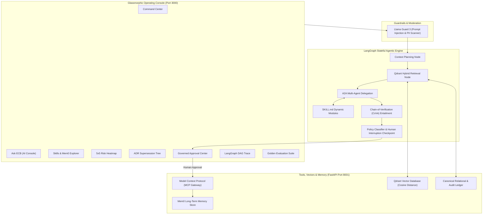

# Enterprise Context Brain (ECB) v2.2

> **GenAI Decision Intelligence & Governed Organizational Memory Operating Console**  
> Built with **LangGraph**, **Mem0**, **Qdrant**, **Llama Guard 3**, **Agent-to-Agent (A2A)**, **Model Context Protocol (MCP)**, **SKILL.md**, and **Chain-of-Verification (CoVe)**.

---

## 🌟 Advanced Modern GenAI Stack



---

## 🚀 Key Modern Capabilities

1. **LangGraph Stateful Orchestration**:
   - Cyclic multi-agent graph with `StateGraph`, checkpoints, and human interruption nodes (`interrupt_before=["mcp_execution_node"]`).
2. **Model Context Protocol (MCP)**:
   - JSON-RPC standard tool & resource gateway (`jira_update_issue`, `jira_create_issue`, `git_tag_release`, `slack_send_briefing`).
3. **Agent-to-Agent (A2A) Collaboration**:
   - Structured subtask delegation between Manager Agent and domain specialists (Project, Risk, Decision, Security).
4. **Mem0 Dynamic Long-Term Memory**:
   - Personalized continuous learning store capturing resolution patterns and human approval context.
5. **Qdrant Vector Database**:
   - 384-dimensional dense embeddings + BM25 sparse keyword overlap with metadata payload filtering.
6. **Llama Guard 3 Safety Layer**:
   - Real-time scanning against prompt injection, jailbreaks, PII leakage, and malicious tool invocations.
7. **`SKILL.md` Modular Playbooks**:
   - Dynamic discovery of domain playbooks from `backend/skills/*/SKILL.md` with YAML frontmatter.
8. **Chain-of-Verification (CoVe)**:
   - Factual claim decomposition and NLI entailment validation ($>95\%$ groundedness gate).

---

## 🏃 Quick Start

### Start Everything (One-Click)
```powershell
.\start.ps1
```
Or double-click `start.bat`.

- **Frontend Operating Console**: [http://localhost:3000](http://localhost:3000)
- **FastAPI Backend & Swagger Docs**: [http://127.0.0.1:8001/docs](http://127.0.0.1:8001/docs)

---

## 🧪 Testing

Run backend tests:
```powershell
cd backend
python -m pytest tests/
```

Run frontend build validation:
```powershell
cd frontend
npm run build
```
