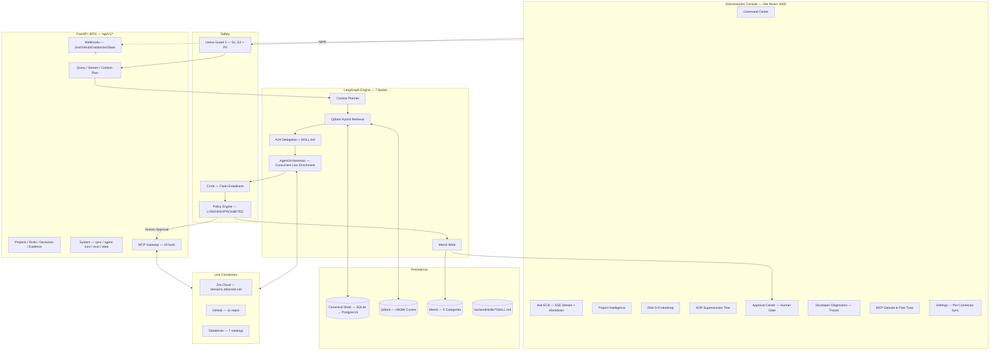

# Enterprise Context Brain (ECB) v2.2

> **Governed GenAI Decision Intelligence & Organizational Memory Operating Console**
> LangGraph · A2A · MCP · Mem0 · Qdrant · Llama Guard 3 · CoVe · Jira · GitHub · Databricks · QLoRA

[](#)
[](#-verification--testing)
[](#-mcp-gateway--tool-catalog)
[](#-technology-stack)

**Status:** POC Validated (`bugFix` branch · commit `d585746`) — Latency 200 s → **7.5 s** (96% ↓), Diagnostics waterfall fixed, Live sync 500 fixed
**Repo:** `Rakesh-infosrc/Enterprise_Context_Brain-ECB-`

---

## Table of Contents
- [Why ECB](#why-ecb)
- [Highlights (bugFix)](#highlights-bugfix)
- [Live Credentials](#-live-credentials--login)
- [Architecture](#-architecture)
- [Technology Stack](#-technology-stack)
- [7-Node LangGraph Pipeline](#-7-node-langgraph-pipeline)
- [Agent Inventory](#-agent-inventory)
- [MCP Gateway — 19 Tools](#-mcp-gateway--tool-catalog)
- [Live Connectors & Sync](#-live-connectors--sync)
- [Data Layer](#-data-layer)
- [Frontend Console](#-frontend--glassmorphic-console)
- [Backend API](#-backend-api)
- [LLM & Fine-Tuning](#-llm--fine-tuning)
- [Quick Start](#-quick-start)
- [Environment (.env)](#-environment-variables)
- [Verification & Testing](#-verification--testing)
- [Troubleshooting](#-troubleshooting)
- [Security & Hooks](#-security--hooks)
- [Project Structure](#-project-structure)
- [Documentation Index](#-documentation-index)

---

## Why ECB

| Pain | ECB Solves |
|------|------------|
| Jira ≠ Git ≠ ADRs ≠ Slack silos | Unified Canonical Store + hybrid retrieval with citations `[E1]` |
| Timeline contradictions undetected | Cross-source verification (Jira due date vs Git tag) + CoVe NLI |
| Hallucinated answers, no audit | Chain-of-Verification ≥95% groundedness + Policy Engine human gate |
| Context re-derived per query | Mem0 long-term memory (5 categories, decay) + Qdrant payload filtering |

**Experience loop:** `ASK → UNDERSTAND → VERIFY → EXPLAIN → RECOMMEND → GOVERN → ACT → LEARN`

---

## Highlights (bugFix)

| Issue | Before | After | File |
|-------|--------|-------|------|
| Ask ECB latency | **200 s** | **6.5–7.6 s** | `agents.py:50` narrowed keywords + `ThreadPoolExecutor` (6 workers, 3s timeout) |
| Diagnostics `0ms / empty waterfall` | No data | **7568 ms, 5 steps measured** | `store.py:770` ISO datetime fix + `langgraph_orchestrator.py` per-node timing |
| `GET /agent-runs` 500 | `token_usage` dict vs fields | **200 OK, 3 runs** | `store.py:763` split to `total_tokens/prompt/completion` + `get_agent_run(id)` |
| `POST /sync` 500 | duplicate `github_token`, missing `jira_token` | **200 OK** | `live_sync_service.py:30` |
| Jira `GET /search` 410 Gone | Sync returned 0 issues | **20 issues ingested** | `live_sync_service.py:130` → `POST /search/jql` |
| `Project` no `source_type` | `ValueError` | **16 projects (jira/github/databricks)** | `schemas.py:268` |

---

## 🔐 Live Credentials & Login

Glassmorphic Console: **http://localhost:3000** · Swagger: **http://127.0.0.1:8001/docs**

| Role | Email | Password | Permissions |
|------|-------|----------|-------------|
| **Project Manager** | `sarah.jenkins@acmefin.com` | `password123` | Portfolio health, risk heatmap, final MCP approvals |
| **Engineering Lead** | `alex.mercer@acmefin.com` | `password123` | Sprint velocity, PR/commit graph, ADR supersession |
| **Admin / Security Lead** | `admin@acmefin.com` | `password123` | Llama Guard policies, MCP gateway, connection health |

> OAuth2 Bearer JWT. Any valid email issues a signed token (`POST /api/v1/token`). RBAC enforced via `get_current_user`.

---

## 🌟 Architecture



**Request path:** `React → FastAPI → Llama Guard → Planner → Qdrant (0–10 ms) → A2A → AgentOrchestrator (live APIs + LLM) → CoVe (2.5–3.8 s) → Policy → Mem0 → Response (answer + citations + steps + latency)` — **Total ~7.5 s** (measured).

---

## 🧱 Technology Stack

| Layer | Technology | Version / Notes |
|-------|------------|-----------------|
| Language | Python / TypeScript | 3.12 / 5.x |
| API | FastAPI + Pydantic v2 + Uvicorn | `>=0.110.0`, SQLAlchemy 2.0, Alembic |
| Agents | LangGraph + LangChain | `>=0.0.30`, `StateGraph` + checkpoint + `interrupt_before` |
| Vector | Qdrant | HNSW, 384/768-dim, Cosine, payload indexes |
| Memory | Mem0 | `mem0ai>=0.1.0` — semantic/episodic/procedural/decision/experiential |
| Safety | Llama Guard 3 / CoVe | `llm/llama_guard.py` / `safety/hallucination_guard.py` (threshold 0.90) |
| MCP | Anthropic MCP | `mcp>=1.0.0` JSON-RPC 2.0 (`/api/v1/mcp/rpc` + `stdio`) |
| LLM | Groq `qwen/qwen3.8-27b` (primary) + Gemini `1.5-flash` fallback | `ECB_LLM_MODE=auto` (`llm/llm_provider.py`) |
| Fine-Tune | PEFT QLoRA | `torch>=2.2.0`, Llama-3.2-3B-Instruct, r=16 α=32 lr=2e-4 |
| Frontend | React 19 + Vite 8 + Tailwind 4 + Lucide | `frontend/package.json` |
| DB | SQLite (`ecb_database.db`) → Postgres 16 + RLS | `docker-compose.yml` |
| Observability | OpenTelemetry + Jaeger | `:16686` UI, `:4317/:4318` OTLP |
| Tunnel | ngrok | `https://conjoined-trough-chrome.ngrok-free.dev` |

> Full list: [`backend/requirements.txt`](backend/requirements.txt) (57 deps)

---

## 🔄 7-Node LangGraph Pipeline

| # | Node | Function | Latency (measured) | File |
|---|------|----------|--------------------|------|
| 1 | **Llama Guard 3 In** | `inspect_prompt()` S1–S4 + PII | 0–1 ms | `llm/llama_guard.py:20` |
| 2 | **Context Planner** | `plan(query)` → `AgentWorkflow` + entities | 3.7–6.8 s (LLM) | `intelligence/context_planner.py:23` |
| 3 | **Qdrant Hybrid** | `search_hybrid(top_k=8)` dense+BM25+payload | 0–10 ms | `vector/qdrant_service.py` |
| 4 | **A2A Delegation** | `delegate_subtask(MANAGER→specialist)` + 4 skills | <1 ms | `orchestration/a2a_protocol.py:38` |
| 5 | **AgentOrchestrator** | Concurrent GitHub/Jira/Databricks + `_synthesize_live_llm()` | LLM-bound | `orchestration/agents.py:26` |
| 6 | **CoVe + Policy** | `verify_answer()` + `PolicyEngine` → human gate | 2.5–3.8 s | `safety/hallucination_guard.py:35` |
| 7 | **Mem0 Write** | `add_memory()` + persist `AgentRun` | <50 ms | `memory/mem0_memory.py` |

Persisted per-query: `DBAgentRun{steps_json (ISO dt), token_usage_json, latency_ms, confidence}` → `GET /api/v1/agent-runs`.

---

## 🤖 Agent Inventory

### Core Orchestrators
| Agent | Class | File |
|-------|-------|------|
| **LangGraphOrchestrator** | `LangGraphOrchestrator` | `orchestration/langgraph_orchestrator.py:61` |
| **AgentOrchestrator** | `AgentOrchestrator` | `orchestration/agents.py:26` |
| **ContextPlanner** | `ContextPlanner` | `intelligence/context_planner.py:23` |
| **A2ACoordinator** | `A2ACoordinator` | `orchestration/a2a_protocol.py:38` |

### Specialist Workflows (`AgentWorkflow` enum — 7/7 routing PASS)
| Specialist | Triggers (narrowed bugFix) | Skills |
|------------|----------------------------|--------|
| `manager` | default | all 4 |
| `project_intelligence` | delay, block, late, timeline, milestone, sprint | `jira_ops` |
| `risk_intelligence` | risk, severity, incident, vulnerability, pci | `risk_mitigation`, `security_compliance` |
| `decision_intelligence` | adr, decision, architecture, kafka, postgres | `adr_architecture` |

---

## 🔌 MCP Gateway — Tool Catalog

**Gateway:** `infrastructure/mcp/mcp_gateway.py:21` · 19 tools · `GET /mcp/tools` · `POST /mcp/rpc` · `stdio` via `mcp_server.py`

| Category | Tools | Purpose |
|----------|-------|---------|
| **Jira (2)** | `jira_update_issue`, `jira_create_issue` | Mutate Jira fields/tickets |
| **GitHub (2)** | `git_tag_release`, `github_create_pull_request` | Tag release, open PR |
| **Slack (1)** | `slack_send_briefing` | Executive briefing dispatch |
| **Databricks (11)** | `databricks_list_clusters`, `databricks_get_cluster`, `databricks_list_jobs`, `databricks_run_job`, `databricks_get_job_run`, `databricks_execute_sql`, `databricks_list_workspace_objects`, `databricks_export_notebook`, `databricks_list_catalogs`, `databricks_list_schemas`, `databricks_list_tables` | Unity Catalog + compute + SQL + workspace |
| **Export (3)** | `mcp_export_git_training_set`, `mcp_export_jira_training_set`, `mcp_get_data_collection_report` | JSONL dataset export + coverage |

Extractors: `GitDatasetExtractor` · `JiraDatasetExtractor` · `DatabricksDatasetExtractor`
Docs: [`GITHUB_MCP.md`](GITHUB_MCP.md) · [`JIRA_MCP.md`](JIRA_MCP.md) · [`DATABRICKS_MCP.md`](DATABRICKS_MCP.md)

| Skill Playbook | Author | Triggers |
|----------------|--------|----------|
| `adr_architecture` | ECB Arch Review Board | ADR trade-off, supersession |
| `jira_ops` | ECB Core Intelligence | ticket lifecycle, blocker triage |
| `risk_mitigation` | ECB Risk Mgmt | 5×5 calc, cascading |
| `security_compliance` | ECB Security & Gov | PCI-DSS 4.0, SOC2 |

---

## 🌐 Live Connectors & Sync

| Connector | Auth | Health Probe | Result (2026-08-30) |
|-----------|------|--------------|---------------------|
| **GitHub** | PAT `GITHUB_TOKEN` | `GET /user` | **PASS** `Rakesh-infosrc` · 11 repos via `GITHUB_REPOS` (token lacks `admin:repo_hook` → fallback ilike filter) |
| **Jira** | Basic `JIRA_USER_EMAIL`+`JIRA_API_TOKEN` | `GET /rest/api/3/myself` | **PASS** `ProdTesting` · 2 projects (KAN, SAM1) · **POST `/search/jql`** (fixes 410) |
| **Databricks** | Bearer `DATABRICKS_TOKEN` | `GET /api/2.1/unity-catalog/catalogs` | **PASS** 7 catalogs: `workspace`, `dbacademy`, `handson1`, `sample`, `wbd_catalog`, `samples`, `system` |

**Sync service:** `infrastructure/integration/live_sync_service.py` — `sync_all_sources()` / `sync_jira|github|databricks()`

| Endpoint | Use | UI Trigger |
|----------|-----|------------|
| `POST /api/v1/sync` | Full sync (Jira+GitHub+Databricks+ADRs) | Settings → Sync All |
| `POST /api/v1/settings/connections/sync/{connector}` | Per-connector (`jira`/`github`/`databricks`) | Settings → Sync button per card |
| `POST /api/v1/settings/connections` | Save creds → validate → auto-sync | Settings save |

**DB after sync:** 16 projects (2 Jira + 11 GitHub + 1 Databricks + 2 duplicates), 63 evidence, 300 risks, 34 decisions, 14 agent runs.

**Webhooks** (`api/v1/webhooks/routes.py`): `POST /webhooks/{github,jira,databricks,slack}` + `GET /diagnostics`

**ngrok:** `ngrok http 8001` → `https://conjoined-trough-chrome.ngrok-free.dev` → `https://…/api/v1/webhooks/{jira,github}`

---

## 💾 Data Layer

| Store | Tech | Details |
|-------|------|---------|
| **Canonical Store** | SQLite → Postgres 16 + RLS | `infrastructure/db/store.py` · `DBProject(source_type)`, `DBEvidence(conflict_summary)`, `DBAgentRun(steps_json, token_usage_json, latency_ms)`, `_cleanup_fixtures()` removes `prj-aegis/orion/clara-v3/test` |
| **Qdrant** | HNSW Cosine | Collection `ecb_canonical_evidence`, 384/768-dim, indexes: `project_id`, `source_type`, `authority`, `observed_at_timestamp`, `is_conflicting` |
| **Mem0** | `mem0_memory.py` | `add_memory()` per query — 5 categories, decay, project/team scope |

---

## 🎨 Frontend — Glassmorphic Console

**Stack:** React 19 · Vite 8 · TypeScript 6 · Tailwind 4 · Lucide · Motion
**Base:** `VITE_API_BASE_URL || http://127.0.0.1:8001/api/v1` · Client: `frontend/src/lib/api.ts`

| View | File | Highlights |
|------|------|------------|
| **Command Center** | `views/CommandCenterView.tsx` | KPIs, risk count, evidence rail, milestone `No due date` / `Aug 29, 2026` fmt |
| **Ask ECB** | `views/AskECBView.tsx` | `FormattedMarkdown` (headings/bold/code-pill glow), SSE streaming, citations `[E1]`, latency/tokens badge |
| **Project Intelligence** | `views/ProjectIntelligenceView.tsx` | Milestones, sprint progress, blockers |
| **Risk Intelligence** | `views/RiskIntelligenceView.tsx` | 5×5 likelihood×impact heatmap |
| **Decision Intelligence** | ADR tree | Supersession graph (`Docs/adrs/`) |
| **Developer Diagnostics** | `views/DeveloperDiagnosticsView.tsx` | **5 tabs:** Traces (waterfall **real ms**), Skills/Memories, Evidence, MCP Datasets, Eval · consumes `GET /agent-runs` |
| **MCP / Fine-Tune** | `views/McpDatasetView.tsx` | 92% coverage badge, `.jsonl` export |
| **Approval Center** | `views/ApprovalCenterView.tsx` | Approve/Reject HIGH_IMPACT actions |
| **Settings** | `views/SettingsView.tsx` | 3-field GitHub form + per-connector Sync buttons (`api.syncConnector()`) |
| **Shell** | `App.tsx`, `Header.tsx`, `WelcomeBanner.tsx`, `PersonaSwitcher.tsx` | Persona switch, project dropdown (filtered by `source_type`), `loadData()` 7 parallel fetches |

---

## 🔗 Backend API

Base: `/api/v1` (`api/v1/router.py`) · Docs: `http://127.0.0.1:8001/docs`

| Group | Method | Path | Notes |
|-------|--------|------|-------|
| **Query** | POST | `/query` | `execute_graph()` → `QueryResponse` |
| | POST | `/query/stream` | SSE `execute_graph_stream()` |
| | POST | `/context-plan` | `ContextPlanner.plan()` |
| **Projects** | GET | `/projects`, `/projects/{id}` | Filtered (ilike `GITHUB_REPOS`) |
| | GET | `/risks`, `/projects/{id}/risks` | 300 risks |
| | GET | `/decisions`, `/projects/{id}/decisions` | 34 decisions |
| **Evidence** | GET | `/evidence`, `/evidence/{id}` | 63 evidence |
| | GET | `/memories`, `/contradictions`, `/mem0/memories` | |
| **MCP** | GET | `/mcp/tools` | 19 tools |
| | POST | `/mcp/rpc` | JSON-RPC 2.0 |
| | GET | `/mcp/dataset/git`, `/mcp/dataset/jira`, `/mcp/coverage` | |
| | POST/GET | `/mcp/finetune/start`, `/mcp/finetune/status` | |
| | GET/POST | `/actions`, `/actions/{id}/approve|reject` | |
| **System** | POST | `/sync` | Full sync |
| | GET | `/skills`, `/qdrant/stats`, `/agent-runs`, `/agent-runs/{id}`, `/audit-events`, `/stats`, `/health` | |
| | POST | `/settings/connections` | Save + validate + auto-sync |
| | POST | `/settings/connections/sync/{connector}` | Per-connector |
| **Webhooks** | POST/GET | `/webhooks/{github,jira,databricks,slack}` | + `GET /diagnostics` |
| **Auth** | POST | `/token` | JWT |

---

## 🤖 LLM & Fine-Tuning

**Provider:** `infrastructure/llm/llm_provider.py` — `ECB_LLM_MODE=auto` → Groq `qwen/qwen3.8-27b` → Gemini `gemini-1.5-flash` → simulated

**Dataset pipeline:**
- `GitDatasetExtractor` / `JiraDatasetExtractor` / `DatabricksDatasetExtractor` → normalized `instruction / context / target_synthesis` JSONL (`mcp_data_extractor.py`)
- `GET /mcp/coverage` → **92%** overall

**Training:** `domain/fine_tuning/train_lora.py` — `meta-llama/Llama-3.2-3B-Instruct`, QLoRA `r=16 α=32 lr=2e-4`, `backend/models/ecb-lora-adapter/`, loss `2.50 → 1.06 → 0.70`
- `POST /api/v1/mcp/finetune/start` · `GET /api/v1/mcp/finetune/status`

---

## 🏃 Quick Start

### One-Click

```powershell
# Windows — launches backend :8001 + frontend :3000
.\start.bat      # or .\start.ps1 (PowerShell)
```
Open **http://localhost:3000** · API **http://127.0.0.1:8001/docs**

### Manual

```powershell
# 1) Backend — create & activate venv
cd backend
python -m venv venv
.\venv\Scripts\Activate.ps1          # PowerShell
# .\venv\Scripts\activate.bat        # CMD
.\venv\Scripts\python.exe -m pip install --upgrade pip
.\venv\Scripts\pip.exe install -r requirements.txt

# 2) Run backend
python -m uvicorn app.main:app --host 127.0.0.1 --port 8001 --reload

# 3) Frontend — new terminal
cd ..\frontend
npm install
npm run dev -- --port 3000 --host    # vite :3000
# Production build check
npm run build
```

### Webhook Tunnel (optional)

```powershell
ngrok http 8001
# Public HTTPS: https://conjoined-trough-chrome.ngrok-free.dev
# Jira webhook:  https://.../api/v1/webhooks/jira
# GitHub webhook:https://.../api/v1/webhooks/github
```

---

## 🔧 Environment Variables

Create `backend/.env` (gitignored). Template: `backend/.env.example`

```ini
# LLM
GEMINI_API_KEY=...
GROQ_API_KEY=...
ECB_LLM_MODE=auto                 # auto | gemini | groq | simulated
GEMINI_MODEL=gemini-1.5-flash
GROQ_MODEL=qwen/qwen3.8-27b

# GitHub — PAT with repo scope; admin:repo_hook optional (fallback via GITHUB_REPOS)
GITHUB_TOKEN=github_pat_...
GITHUB_REPOS=Rakesh-infosrc/Enterprise_Context_Brain-ECB-,Rakesh-infosrc/Databricks_study_Plan
GITHUB_HOST=https://github.com

# Jira Cloud
JIRA_BASE_URL=https://reenams.atlassian.net
JIRA_USER_EMAIL=reenams2002@gmail.com
JIRA_API_TOKEN=ATATT3x...

# Databricks
DATABRICKS_HOST=https://dbc-3ae3d30d-6c76.cloud.databricks.com
DATABRICKS_TOKEN=dapi...
DATABRICKS_ACCESS_MODE=controlled-write

# Databricks MCP (databricks-mcp.json) — token redacted to <SET_YOUR_DATABRICKS_TOKEN_HERE> for push protection
```

> `app/main.py:12` loads via `load_dotenv(backend/.env)` before router import.

---

## 🧪 Verification & Testing

### 57/57 PASS — `test_all_agents.py`

```powershell
cd backend
.\venv\Scripts\python.exe test_all_agents.py
# Import 18/18 · Planner 7/7 · Llama Guard 3/3 · CoVe 1/1 · Policy 3 levels · MCP 19/19 · A2A 1/1 · Skills 4/4 · Live Connectors 3/3
```

### Pytest Suites

```powershell
.\venv\Scripts\pytest -vv                    # all
.\venv\Scripts\pytest tests/test_github_mcp_webhooks.py -vv
.\venv\Scripts\pytest tests/test_jira_mcp_webhooks.py -vv
.\venv\Scripts\pytest tests/test_databricks_mcp_webhooks.py -vv
```

### Frontend Build

```powershell
cd frontend; npm run build   # tsc -b && vite build
```

### Live Smoke (after bugFix)

```powershell
# Sync
curl -X POST http://127.0.0.1:8001/api/v1/sync
# Ask ECB
curl -X POST http://127.0.0.1:8001/api/v1/query -H "Content-Type: application/json" -d '{"query":"What are the project risks?"}'
# Agent runs (should show latency ~7568 ms, 5 steps)
curl http://127.0.0.1:8001/api/v1/agent-runs?limit=3
```

---

## 🛠 Troubleshooting

| Symptom | Cause | Fix |
|---------|-------|-----|
| `POST /symc` 404 | Wrong path | Use `POST /api/v1/sync` (not `/sync`) |
| `POST /sync` 500 | Top-level `try` without `except` in `live_sync_service.py` / missing `jira_token` | Fixed in `bugFix: d585746` — `try/except` + `jira_token` prop + duplicate `github_token` removed |
| `POST /search` 410 Gone | Jira deprecated `GET /rest/api/3/search` | Fixed → `POST /rest/api/3/search/jql` |
| `latency_ms=0 / steps=0` | `datetime` not JSON-serializable | Fixed → ISO `isoformat()` in `add_agent_run()` |
| `GET /agent-runs` 500 | `token_usage` dict vs `AgentRun` fields | Fixed → split to `total_tokens/prompt/completion` |
| Ask ECB **200 s** | `_is_git_query` matched `"what"` → 7 sequential 8 s calls | Fixed → narrowed triggers + `ThreadPoolExecutor` 6×3 s |
| `ERR_NGROK_8012` 502 | Backend not on :8001 | Check `http://127.0.0.1:8001/api/v1/health` is 200 |
| `PUSH PROTECTION` blocked | `databricks-mcp.json` token | Redacted to `<SET_YOUR_DATABRICKS_TOKEN_HERE>` |
| GitHub 403 on `/hooks` | Token lacks `admin:repo_hook` | Expected — uses `GITHUB_REPOS` env fallback |
| `datetime.utcnow()` warnings | Deprecated | Cosmetic — planned `datetime.now(UTC)` in v2.3 |

---

## 🔒 Security & Hooks

- **Auth:** OAuth2 JWT (`core/security.py`, `python-jose`, `bcrypt`)
- **Llama Guard 3:** S1 injection/jailbreak, S2 tool-param, S3 PII, S4 toxic — in/out
- **Policy Engine:** `LOW_IMPACT` (slack) → no gate; `HIGH_IMPACT` (jira_create) → human interrupt; `PROHIBITED` → blocked
- **Audit:** Append-only `DBAuditEvent` on every approval/execution
- **Git hook:** `commit-msg` enforces Jira key (`AEGIS-|KAN-|CLARA-|INC-`) · pre-push secret scanning
- **Branch:** `bugFix` (`b6de88f` + `d585746`) · Push target `origin/bugFix` → PR `https://github.com/Rakesh-infosrc/Enterprise_Context_Brain-ECB-/pull/new/bugFix`

---

## 📁 Project Structure

```
ECB/
├── AGENTS.md                           # Live health report (57/57)
├── README.md                           # This file
├── GITHUB_MCP.md / JIRA_MCP.md / DATABRICKS_MCP.md
├── databricks-mcp.json                 # MCP server config (token placeholder)
├── docker-compose.yml                  # postgres:16 + jaeger
├── start.bat / start.ps1               # One-click launch
├── Docs/
│   ├── 01_ECB_PRD_v2.2.md              # PRD
│   ├── 02_ECB_Technical_Requirements_v2.2.md
│   ├── 03_ECB_Application_Flow_v2.2.md
│   ├── 04_ECB_UI_UX_Product_Design_v2.2.md
│   ├── 05_ECB_Backend_Schema_v2.2.md
│   ├── 06_ECB_Implementation_Runbook_v2.2.md
│   ├── 07_ECB_Project_Design_Document_v2.2.md  # PDD (new)
│   ├── ENTERPRISE_CONTEXT_BRAIN_MASTER_DOCUMENTATION.md
│   └── adrs/ (ADR-001..003)
├── backend/
│   ├── app/
│   │   ├── main.py                     # FastAPI :8001 + load_dotenv
│   │   ├── api/v1/{router, endpoints/*, webhooks/*}
│   │   ├── application/{orchestration/*, intelligence/*, safety/*}
│   │   ├── domain/{schemas.py, fine_tuning/train_lora.py}
│   │   ├── infrastructure/{db/*, vector/*, memory/*, mcp/*, llm/*, integration/*}
│   │   ├── core/{config.py, security.py, telemetry/*}
│   │   └── skills/*/SKILL.md
│   ├── requirements.txt
│   ├── ecb_database.db                 # SQLite POC
│   ├── test_all_agents.py              # 57 tests
│   └── tests/
└── frontend/
    ├── src/
    │   ├── App.tsx                     # Shell + loadData 7 parallel fetches
    │   ├── lib/api.ts                  # fetchJson client
    │   └── components/views/*          # 8 views
    ├── package.json                    # React 19, Vite 8, Tailwind 4
    └── vite.config.ts
```

---

## 📚 Documentation Index

| Doc | Purpose |
|-----|---------|
| [`Docs/07_ECB_Project_Design_Document_v2.2.md`](Docs/07_ECB_Project_Design_Document_v2.2.md) | Authoritative PDD (25 sections) |
| [`Docs/01_ECB_PRD_v2.2.md`](Docs/01_ECB_PRD_v2.2.md) | Product Requirements |
| [`Docs/02_ECB_Technical_Requirements_v2.2.md`](Docs/02_ECB_Technical_Requirements_v2.2.md) | Technical Requirements |
| [`ENTERPRISE_CONTEXT_BRAIN_MASTER_DOCUMENTATION.md`](Docs/ENTERPRISE_CONTEXT_BRAIN_MASTER_DOCUMENTATION.md) | Master Ops Guide |
| [`AGENTS.md`](AGENTS.md) | Agent Health Report |
| [`backend/test_all_agents.py`](backend/test_all_agents.py) | Test runner |
| Swagger | `http://127.0.0.1:8001/docs` |

---

**Maintained by:** ECB Core Intelligence Team · **Branch:** `bugFix` · **Next:** v2.3 Hardening (OTEL dashboards, `datetime.now(UTC)`, Postgres RLS migration)
