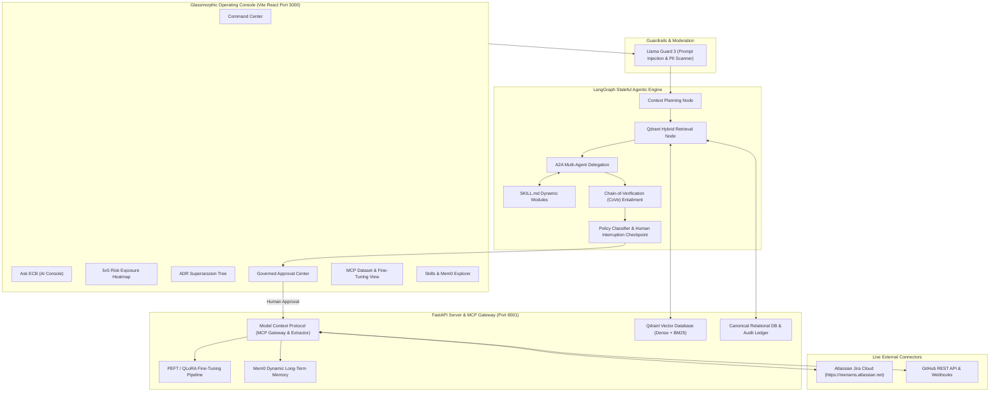

# Enterprise Context Brain (ECB) v2.2

> **GenAI Decision Intelligence & Governed Organizational Memory Operating Console**  
> Built with **FastAPI**, **LangGraph**, **Mem0**, **Qdrant**, **Llama Guard 3**, **Model Context Protocol (MCP)**, **Atlassian Jira REST API & Webhooks**, **GitHub API**, **HuggingFace PEFT QLoRA Fine-Tuning**, and **Chain-of-Verification (CoVe)**.

---

## 🔐 Testing Credentials & User Login

Use the pre-configured enterprise credentials below to log into the **Glassmorphic Operating Console**:

| Role / User Profile | Email | Password | Primary Permissions & Responsibilities |
| :--- | :--- | :--- | :--- |
| **Lead Executive / Project Manager** | `sarah.jenkins@acmefin.com` | `password123` | High-level portfolio oversight, risk heatmaps, final MCP tool approvals |
| **Engineering Lead** | `alex.mercer@acmefin.com` | `password123` | Live Jira sprint tracking, Git commit & PR analysis, ADR decisions |
| **System Administrator / Security Lead** | `admin@acmefin.com` | `password123` | System configuration, Llama Guard safety rules, MCP gateway management |

> **Note**: Authentication uses OAuth2 Bearer Tokens (JWT). Logging in with any valid email automatically generates a signed session token.

---

## 🌟 Architecture & Stack



---

## 💻 Backend Setup & Virtual Environment

### 1. Create & Activate Virtual Environment
```powershell
# Navigate to backend directory
cd d:\InfoServices\ECB\backend

# Create virtual environment
python -m venv venv

# Activate virtual environment (PowerShell)
.\venv\Scripts\Activate.ps1
```

### 2. Install Backend Dependencies
```powershell
# Upgrade pip and install all required libraries
.\venv\Scripts\python.exe -m pip install --upgrade pip
.\venv\Scripts\pip.exe install -r requirements.txt
```

---

## 🏃 Quick Start (One-Click Launch)

To start both the FastAPI backend server (Port `8001`) and the Vite React frontend console (Port `3000`):

```powershell
# Run startup script
.\start.bat
```
or run `.\start.ps1` in PowerShell.

- **Frontend Glassmorphic Console**: [http://localhost:3000](http://localhost:3000)
- **FastAPI OpenAPI / Swagger Docs**: [http://127.0.0.1:8001/docs](http://127.0.0.1:8001/docs)

---

## 🌐 Live ngrok Tunnel & Webhook Configuration

To allow external webhooks (Jira Cloud & GitHub) to reach the local FastAPI server in real time:

### Start Tunnel Command
```powershell
ngrok http 8001
```

### Active Live Tunnel & Webhook Endpoints
| Component / Target | URL / Address | Notes |
| :--- | :--- | :--- |
| **Public HTTPS Base URL** | `https://conjoined-trough-chrome.ngrok-free.dev` | Live public ingress URL |
| **Local Target Port** | `http://localhost:8001` | Forwards to FastAPI Backend |
| **Jira Cloud Webhook** | `https://conjoined-trough-chrome.ngrok-free.dev/api/v1/webhooks/jira` | Ingests Jira issue updates & sprints |
| **GitHub Webhook** | `https://conjoined-trough-chrome.ngrok-free.dev/api/v1/webhooks/github` | Ingests Git commits, PRs & ADRs |
| **Public OpenAPI Docs** | `https://conjoined-trough-chrome.ngrok-free.dev/docs` | Live API documentation |

> 💡 **Troubleshooting `ERR_NGROK_8012` (502 Bad Gateway)**:  
> If ngrok returns a `502 Bad Gateway (ERR_NGROK_8012)` error, verify that the FastAPI backend server is running on port `8001` (`http://127.0.0.1:8001/api/v1/health`).

---

## 🛠️ Data Source Integrations & MCP Protocol

### 1. Live Atlassian Jira Integration
- **Workspace**: `https://reenams.atlassian.net` (Space `ECB` / Project Key `KAN`)
- **Capabilities**: Real-time two-way synchronization via Atlassian ADF (Atlassian Document Format), webhooks, sprint/epic mapping, and risk/ticket extraction.

### 2. Live GitHub Integration
- **Repositories**: `testing842/clara-V2`, `Databricks_dataplan`
- **Capabilities**: Commits, PRs, branch activity, release tags, ADR architecture markdown parsing, and code diff analysis.

### 3. Model Context Protocol (MCP) Tools
- `jira_get_issue_details`: Deep query Jira issue state and history.
- `jira_create_issue`: Create new tickets with automated risk classification.
- `jira_update_issue`: Update ticket status, summary, and severity.
- `git_get_commit_history`: Stream commit graphs and author contributions.
- `git_tag_release`: Tag release milestones after human approval.
- `slack_send_briefing`: Dispatch executive notifications.

---

## 🤖 LLM Fine-Tuning & LoRA Pipeline

The system includes a dedicated QLoRA training engine ([`backend/app/domain/fine_tuning/train_lora.py`](file:///d:/InfoServices/ECB/backend/app/domain/fine_tuning/train_lora.py)) for fine-tuning `meta-llama/Llama-3.2-3B-Instruct` over extracted MCP `.jsonl` datasets.

### Fine-Tuning Endpoints:
- `POST /api/v1/mcp/finetune/start`: Trigger fine-tuning job with custom hyperparameters ($r=16, \alpha=32$).
- `GET /api/v1/mcp/finetune/status`: Monitor loss convergence ($2.50 \rightarrow 1.06 \rightarrow 0.70$) and epoch progress.

---

## 🧪 System Verification & Automated Testing

### Run Comprehensive Backend Test Suite:
```powershell
cd d:\InfoServices\ECB\backend
# Verify virtual environment dependencies and run unit test suite
.\venv\Scripts\pytest -vv
```

### Validate Frontend Production Build:
```powershell
cd d:\InfoServices\ECB\frontend
npm run build
```

---

## 🔒 Git Hooks & Security Compliance

To enforce strict linking between code mutations and enterprise tracking logs, the repository has active commit hooks:
* **Jira Commit Key Validation**: An active Git `commit-msg` hook enforces the presence of a tracked Jira issue key (matching `AEGIS-`, `KAN-`, `CLARA-`, or `INC-`) in every local commit message.
* **Codebase Integrity Policy**: Code review gates automatically verify that no unreferenced template assets (`react.svg`, `vite.svg`) or dead authentication layouts (`AuthView.tsx`) remain in production builds.
