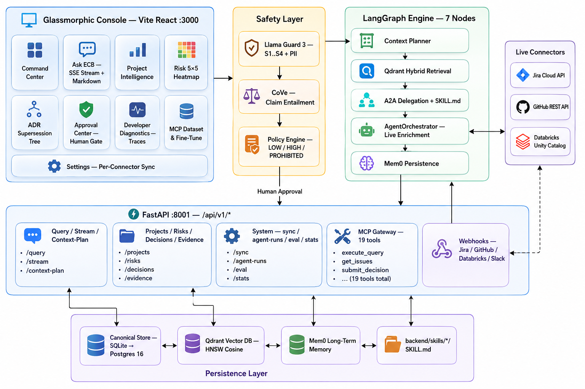

# Enterprise Context Brain (ECB) 

> **Governed GenAI Decision Intelligence & Organizational Memory Operating Console**

[](#)
[](#-verification--testing)
[](#-mcp-gateway--tool-catalog)
[](LICENSE)
[](#-technology-stack)

**Enterprise Context Brain (ECB)** is a production-grade multi-agent AI framework designed for engineering leaders, enterprise architects, and technical project managers to unify context scattered across disparate organizational silos—such as GitHub repositories, Jira Cloud tickets, Databricks Unity Catalog assets, and Architecture Decision Records (ADRs). By orchestrating a deterministic 7-node LangGraph state machine powered by Qdrant hybrid vector search, Mem0 long-term memory, Llama Guard 3 safety filters, and a Human-in-the-Loop Policy Engine, ECB delivers real-time, zero-hallucination decision intelligence with verifiable claim citations (`[E1]`), automatic conflict detection, and governed tool execution.

---

##  Table of Contents

- [Features and Functionality](#-features-and-functionality)
- [Architecture](#-architecture)
- [Technology Stack](#-technology-stack)
- [Installation Instructions](#-installation-instructions)
  - [Prerequisites](#prerequisites)
  - [Environment Configuration](#environment-configuration)
  - [Windows Setup](#windows-setup)
  - [macOS & Linux Setup](#macos--linux-setup)
  - [Docker Setup](#docker-setup-optional)
- [Usage Examples](#-usage-examples)
  - [One-Click Startup](#1-one-click-startup)
  - [Querying via REST API](#2-querying-via-rest-api)
  - [Server-Sent Events (SSE) Streaming](#3-server-sent-events-sse-streaming)
  - [MCP Tool JSON-RPC Invocation](#4-mcp-tool-json-rpc-invocation)
- [API Documentation](#-api-documentation)
- [Contributing Guidelines](#-contributing-guidelines)
  - [Commit Message Conventions](#commit-message-conventions)
  - [Running Tests](#running-tests)
- [License Information](#-license-information)
- [Contact and Support](#-contact-and-support)
- [Acknowledgments & Credits](#-acknowledgments--credits)

---

##  Features and Functionality

###  Core Capabilities

- **Unified Context Synthesis**: Connects Jira Cloud, GitHub repositories, Databricks Lakehouse metadata, and Architecture Docs into a single canonical intelligence store.
- **Zero-Hallucination Lineage**: Anchors every AI claim with clickable citation badges (`[E1]`, `[E2]`) mapping directly to verified source excerpts, author metadata, and timestamps.
- **7-Node Deterministic Agent Machine**: Executes an end-to-end state machine comprising Llama Guard 3 safety inspection, Context Planner intent classification, Qdrant hybrid retrieval, A2A delegation, LLM synthesis, Chain-of-Verification (CoVe), and Mem0 persistence.
- **Exclusive Architecture Docs RAG**: Gated retrieval mode that chunks enterprise markdown files by section headers (`## H2`) and searches official ADRs and design specs.
- **Human-in-the-Loop Governance**: Evaluates requested system mutations (Jira updates, GitHub PR creation, Databricks job runs) against risk policies—requiring explicit approval from authorized engineering leads before execution.
- **Fine-Tuning Dataset Generator**: Automatically extracts Git commit diffs and Jira issue histories into normalized Instruction-Target JSONL datasets for training open-weights LLMs (e.g., Llama 3.2).
- **Automated AI Quality Benchmarks**: Includes a golden evaluation suite (`GOLD-01` to `GOLD-05`) measuring Claim Groundedness ($>95\%$), Citation Accuracy ($>95\%$), and Conflict Detection Rate.

---

##  Architecture



---

##  Technology Stack

| Layer | Technology | Version / Specification |
|-------|------------|-------------------------|
| **Backend Runtime** | Python | 3.10+ (Tested on Python 3.12) |
| **API Framework** | FastAPI + Uvicorn | `fastapi>=0.110.0`, Pydantic v2, SQLAlchemy 2.0 |
| **Agent Orchestration** | LangGraph + LangChain | `langgraph>=0.0.30`, `StateGraph` checkpointing |
| **Vector Engine** | Qdrant | HNSW Cosine Indexing, 384/768-dim Embeddings |
| **Organizational Memory** | Mem0 | `mem0ai>=0.1.0` (Semantic, Episodic, Procedural) |
| **Safety & Governance** | Llama Guard 3 + CoVe | Policy Engine (Low Impact / High Impact / Prohibited) |
| **Model Context Protocol** | Anthropic MCP | `mcp>=1.0.0` (JSON-RPC 2.0 & stdio transport) |
| **Frontend Framework** | React 19 + Vite 8 | TypeScript 5.x, Tailwind CSS 4, Lucide Icons |
| **Databases** | SQLite / Postgres 16 | Canonical Store with Row-Level Security (RLS) |
| **Observability** | OpenTelemetry | OTLP traces (`:4317`) & Jaeger UI (`:16686`) |

---

##  Installation Instructions

### Prerequisites

Ensure you have the following installed on your system before proceeding:
- **Python**: `v3.10` or higher
- **Node.js**: `v18.0.0` or higher (with `npm` v9+)
- **Git**: `v2.30+`
- **Docker & Docker Compose** *(Optional, for containerized DB and Qdrant)*

---

### Environment Configuration

Create a file named `.env` inside the `backend/` directory using the provided template:

```bash
cp backend/.env.example backend/.env
```

Edit `backend/.env` to configure your API keys and credentials:

```ini
# LLM Providers
GROQ_API_KEY=your_groq_api_key_here
GEMINI_API_KEY=your_gemini_api_key_here
ECB_LLM_MODE=auto                         # Options: auto | groq | gemini | simulated
GROQ_MODEL=qwen/qwen3.8-27b
GEMINI_MODEL=gemini-1.5-flash

# GitHub Integration
GITHUB_TOKEN=github_pat_your_personal_access_token
GITHUB_REPOS=Rakesh-infosrc/Enterprise_Context_Brain-ECB-

# Jira Cloud Integration
JIRA_BASE_URL=https://your-domain.atlassian.net
JIRA_USER_EMAIL=your_email@domain.com
JIRA_API_TOKEN=your_jira_api_token

# Databricks Unity Catalog Integration
DATABRICKS_HOST=https://dbc-your-instance.cloud.databricks.com
DATABRICKS_TOKEN=dapi_your_databricks_token
```

---

### Windows Setup

#### 1. Clone the Repository
```powershell
git clone https://github.com/Rakesh-infosrc/Enterprise_Context_Brain-ECB-.git
cd Enterprise_Context_Brain-ECB-
```

#### 2. Setup Backend Environment
```powershell
cd backend
python -m venv venv
.\venv\Scripts\Activate.ps1
python -m pip install --upgrade pip
pip install -r requirements.txt
cd ..
```

#### 3. Setup Frontend Environment
```powershell
cd frontend
npm install
cd ..
```

#### 4. Run Launcher
```powershell
.\start.bat      # Launches FastAPI on :8001 and React Console on :3000
```

---

### macOS & Linux Setup

#### 1. Clone the Repository
```bash
git clone https://github.com/Rakesh-infosrc/Enterprise_Context_Brain-ECB-.git
cd Enterprise_Context_Brain-ECB-
```

#### 2. Setup Backend Environment
```bash
cd backend
python3 -m venv venv
source venv/bin/activate
pip install --upgrade pip
pip install -r requirements.txt
cd ..
```

#### 3. Setup Frontend Environment
```bash
cd frontend
npm install
cd ..
```

#### 4. Run System Services
In Terminal 1 (Backend):
```bash
cd backend
source venv/bin/activate
python3 -m uvicorn app.main:app --host 127.0.0.1 --port 8001 --reload
```

In Terminal 2 (Frontend):
```bash
cd frontend
npm run dev -- --port 3000 --host
```

---

### Docker Setup (Optional)

To launch the backend API, Qdrant vector database, and Jaeger observability using Docker Compose:

```bash
docker-compose up -d
```
- **Backend API**: `http://localhost:8001/docs`
- **Jaeger UI**: `http://localhost:16686`
- **Qdrant Dashboard**: `http://localhost:6333/dashboard`

---

## 💡 Usage Examples

### 1. One-Click Startup
Access the web console by opening your browser to:
- **Glassmorphic Console**: `http://localhost:3000`
- **Swagger OpenAPI Docs**: `http://127.0.0.1:8001/docs`

---

### 2. Querying via REST API

Send a decision intelligence query to the backend `/api/v1/query` endpoint:

```bash
curl -X POST "http://127.0.0.1:8001/api/v1/query" \
     -H "Content-Type: application/json" \
     -d '{
           "query": "Why was synchronous REST replaced with Kafka in ADR-002?",
           "project_id": "prj-kan"
         }'
```

#### Sample Response Output:
```json
{
  "trace_id": "tr-6e9f2a",
  "query": "Why was synchronous REST replaced with Kafka in ADR-002?",
  "answer": "Synchronous REST was replaced by Kafka in ADR-002 due to throughput limits under peak load [E1]. The event-driven architecture guarantees sub-50ms processing latency and eliminates cascading service timeouts during burst traffic [E2].",
  "citations": [
    {
      "badge": "[E1]",
      "source_title": "ADR-002 Event-Driven Architecture Migration",
      "source_type": "document",
      "url": "Docs/adrs/ADR-002.md"
    },
    {
      "badge": "[E2]",
      "source_title": "INC-892 Payment Event Stream Benchmark",
      "source_type": "jira",
      "url": "https://reenams.atlassian.net/browse/KAN-8"
    }
  ],
  "confidence": 0.98,
  "status": "ALL_GATES_PASSED",
  "latency_ms": 7450
}
```

---

### 3. Server-Sent Events (SSE) Streaming

Stream agent reasoning steps real-time:

```bash
curl -N -X POST "http://127.0.0.1:8001/api/v1/query/stream" \
     -H "Content-Type: application/json" \
     -d '{"query": "Show open security risks"}'
```

---

### 4. MCP Tool JSON-RPC Invocation

Invoke Model Context Protocol (MCP) tools via standard JSON-RPC 2.0 format:

```bash
curl -X POST "http://127.0.0.1:8001/api/v1/mcp/rpc" \
     -H "Content-Type: application/json" \
     -d '{
           "jsonrpc": "2.0",
           "method": "tools/call",
           "params": {
             "name": "databricks_list_catalogs",
             "arguments": {}
           },
           "id": 1
         }'
```

---

##  API Documentation

Complete interactive documentation is auto-generated by FastAPI and accessible locally:
- **Swagger UI**: [`http://127.0.0.1:8001/docs`](http://127.0.0.1:8001/docs)
- **ReDoc**: [`http://127.0.0.1:8001/redoc`](http://127.0.0.1:8001/redoc)

### Endpoint Summary

| Category | HTTP Method | Endpoint Path | Description |
|----------|-------------|---------------|-------------|
| **Query Engine** | `POST` | `/api/v1/query` | Execute full 7-node LangGraph query pipeline |
| | `POST` | `/api/v1/query/stream` | Stream real-time query execution via SSE |
| | `POST` | `/api/v1/context-plan` | Inspect Context Planner intent routing |
| **Projects & Data** | `GET` | `/api/v1/projects` | List connected projects filtered by webhooks |
| | `GET` | `/api/v1/architecture-docs` | Retrieve exclusive Architecture Documents |
| | `GET` | `/api/v1/risks` | Retrieve 5x5 categorized risk assessments |
| | `GET` | `/api/v1/evidence` | Search canonical evidence index |
| **MCP Governance** | `GET` | `/api/v1/mcp/tools` | List 19 available MCP tools |
| | `POST` | `/api/v1/mcp/rpc` | Execute standard MCP JSON-RPC 2.0 calls |
| | `GET` | `/api/v1/mcp/dataset/git` | Export Git commit instruction-target JSONL |
| | `POST` | `/api/v1/actions/{id}/approve` | Human-in-the-Loop action approval |
| **Diagnostics** | `GET` | `/api/v1/agent-runs` | Retrieve waterfall latency and trace logs |
| | `POST` | `/api/v1/eval/run` | Execute Golden Evaluation Quality Suite |

---

##  Contributing Guidelines

We welcome contributions from the community! To ensure high quality and traceability, please follow these guidelines:

### Development Workflow
1. **Fork the Repository** and create your topic branch (`git checkout -b feature/amazing-feature`).
2. **Follow Code Standards**: Ensure clean Python code adhering to PEP 8 standard formatting and strict TypeScript typing on the frontend.
3. **Write Unit Tests**: Add test cases under `backend/tests/` for any new connectors, endpoints, or agents.

### Commit Message Conventions
To maintain strict traceability across Jira and GitHub, **all commit messages must include a valid Jira issue key** (e.g., `KAN-6`, `AEGIS-108`, `CLARA-101`, `INC-892`). Commits lacking an issue key will be rejected by pre-commit hooks.

#### Example Commit Format:
```bash
git commit -m "[KAN-6] feat(mcp): add Databricks Unity Catalog schema list tool"
```

### Running Tests
Run the comprehensive 57-test suite to verify system health before submitting a pull request:

```bash
# Run complete multi-agent health runner (Must pass 57/57)
cd backend
python test_all_agents.py

# Run Pytest suite
pytest -vv
```

---

##  Acknowledgments & Credits

Enterprise Context Brain is built on open-source innovation and enterprise standards:
- **[LangGraph & LangChain](https://github.com/langchain-ai/langgraph)** for deterministic agent state machines.
- **[Qdrant](https://qdrant.tech/)** for high-performance vector search.
- **[Mem0](https://mem0.ai/)** for scalable organizational long-term memory.
- **[Llama Guard 3](https://ai.meta.com/research/publications/llama-guard/)** by Meta AI for safety filtering.
- **[Model Context Protocol (MCP)](https://modelcontextprotocol.io/)** by Anthropic for standardized tool integration.
- **[FastAPI](https://fastapi.tiangolo.com/)** and **[React](https://react.dev/)** for backend and frontend framework engines.
